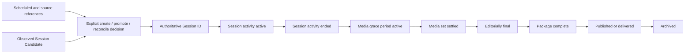

# Session lifecycle

This document separates verified current behavior from the accepted target lifecycle.
It does not define unresolved promotion, reconciliation, or late-media policy.

## Current observed lifecycle

There is no authoritative `Session` entity, creation command, repository, schema, or API.
Current Session-related contracts are independent values:

- `SessionWindow` represents a proposed or verified range. Its statuses are `proposed`,
  `review_needed`, `verified`, `rejected`, `superseded`, and `archived`.
- `SessionWindowProduct` is a verified operational product with `created`, `active`,
  `ready_for_package`, `completed`, `cancelled`, `superseded`, and `archived` statuses.
- Operational State supports Session Candidate and Session Product subjects. The Session
  transition policy evaluates `inactive`, `active`, `ending`, and `ended` values.
- Transition evaluation, acceptance, and in-memory commit are caller-driven. The
  repository is thread-safe but explicitly process-local and disposable.
- Completed Media Asset intentionally carries no inferred Session identity.

These states belong to different contracts and must not be combined into an invented
current Session state machine. In particular, Operational State `ended` does not mean
media settled, editorially final, packaged, delivered, or archived.

## Accepted authority and identity

- Session is a first-class durable StageFlow domain concept.
- StageFlow assigns one immutable Session ID.
- Schedule-platform, recorder, and other provider IDs are versioned external references,
  not the sole Session identity.
- An observed Session Candidate may propose association or creation, but cannot silently
  become authoritative.
- Operational State remains an assertion/projection about a subject and cannot become
  the Session aggregate.

Who may create or promote a Session, how scheduled and observed identities reconcile,
and whether operators may split, merge, or reassign remain open.

## Accepted target lifecycle

The disposition approves distinct lifecycle dimensions and milestones rather than one
overloaded status:

This is an accepted milestone sequence, not a set of implemented enum names. A future ADR
may allow policy-specific transitions or revisions while preserving the distinctions.

## Transition ownership

### Current implementation

The Session transition policy proposes Operational State from Evidence. A separate
acceptance boundary decides whether to accept the proposal, and an optional in-memory
repository commits accepted state. Callers own invocation and prior-state selection.

### Accepted direction

The durable Session aggregate owns authoritative Session lifecycle changes. Reasoning and
Operational State may propose or explain a change; they do not silently mutate Session.
Human or approved-system authority for creation, promotion, reopening, split/merge, and
override must be explicit and attributable.

## Completion and finalization

- **Session activity ended:** production activity appears to have stopped.
- **Media grace period active:** the system still expects or permits late source media.
- **Media set settled:** the accepted media-set policy permits downstream finalization.
- **Editorially final:** authorized review decisions for the revision are complete.
- **Package complete:** a package revision satisfies its approved manifest/checklist.
- **Published or delivered:** an external result/receipt has been durably recorded.
- **Archived:** the approved retention/archive workflow has recorded the historical state.

No current implementation owns these target milestones. Package, publication, delivery,
and archive behavior is deferred until durable Session, media, editorial, and operation
foundations exist.

## Persistence and recovery expectations

- Session identity, external references, lifecycle revisions, media associations, and
  authoritative decisions must survive process and machine restart.
- One relational durable store inside the modular monolith is the accepted direction;
  exact technology, schema, and migrations remain open.
- Append-oriented records are used where lineage, replay, and human decision history need
  them; full event sourcing is not required.
- Startup reconciliation must precede reliance on watchers/background loops.
- Operator status must show current milestone, incomplete prerequisites, failure/retry,
  connectivity requirements, and whether finalization is safe.

## Late-arriving work

Late media must not silently mutate published history. The accepted direction is a
reviewable revision, explicit reopening action, or quarantine condition. Still open:

- default media grace duration;
- automatic versus operator-approved reopening;
- treatment after package completion or publication;
- event-mode-specific policies;
- how corrections to schedule, Event, or Stage references affect an existing Session.

## Required invariants

1. A Session has one immutable StageFlow ID; external IDs are versioned references.
2. Candidate or schedule facts do not create authority without an explicit decision.
3. Operational State, timeline windows, media completeness, editorial finality, package,
   delivery, and archive meanings remain distinct.
4. Every authoritative change records actor/system authority, aware time, reason,
   correlation, prior revision, and resulting revision.
5. Semantically different source, evaluation, acceptance, commit, and organizational
   anchor times remain separate.
6. Human editorial/verification decisions remain append-only and attributable.
7. Restart and repeated delivery cannot create an unrelated Session or duplicate an
   already accepted transition.
8. Finalization cannot infer that missing or late media is harmless.

## Open questions requiring ADR or product decision

- Exact Session creation and promotion authority.
- Scheduled/observed reconciliation, correction, split, merge, and reassignment rules.
- Business Event and Stage ownership and reference lifecycles.
- Operator override permissions and audit requirements.
- Detailed late-media/reopening policy and default grace duration.
- Initial persistence schema, migration tool, backup/restore, and deployment topology.
- Detailed finalization, package, delivery, and archive state machines.
