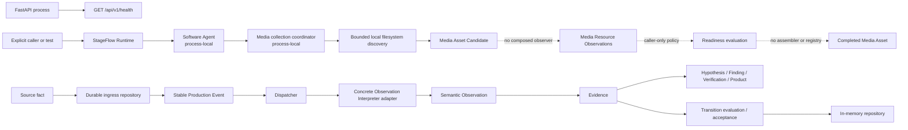

# StageFlow system context

**Baseline:** Durable Event-Mode Kernel implementation candidate, prepared for
independent review after the Contract Stabilization foundation

## System purpose

StageFlow is intended to observe live-event recorded media and supporting production
signals, preserve explainable reasoning and human authority, and eventually coordinate
durable production, editorial, packaging, and delivery workflows. At the current
baseline, it includes a bounded durable Event/Stage/Session/media Kernel behind the
existing shell; it remains an implementation candidate rather than event-ready software.

## External actors and systems

| Actor or system | Current interaction | Accepted future boundary |
| --- | --- | --- |
| Developer/operator | Loads validated Kernel configuration, explicitly bootstraps Event/Stages, and invokes application commands | Uses a future authenticated setup/control surface |
| Technical producer/event operations | Reads Kernel Event/Stage/Session/media/recovery status through an API; no UI | Uses future Mission Control workflows |
| Editorial/marketing reviewer | No implemented workflow | Reviews explainable Findings/Candidate Moments; humans retain approval authority |
| Recording/shared-storage system | Files may be inspected only by an explicit one-shot local discovery call | Remains source of media; StageFlow registers completed assets by reference |
| Schedule/conference system | Adapter contracts only | Remains source of planned conference data and external identifiers |
| Transcript/vision providers | Adapter/interpreter contracts only | Optional providers behind adapters; unavailable service must not stop local event work |
| Publishing/delivery destinations | No implementation | Provider-neutral durable operations with idempotency and reconciliation |

An application caller can create a durable human-authorized Session and register media
through the Kernel service. No actor can claim a Job, run transcription, publish
editorial output, control a recorder, or deliver an output.

## Current runtime components

| Component | Current responsibility | State/durability |
| --- | --- | --- |
| FastAPI application | Preserve liveness; optionally load Kernel configuration, verify schema, reconcile, and serve read-only status | PostgreSQL authority; process state is composition only |
| Next.js application | Render one static status page | No backend client or workflow state |
| Shared contracts | IDs, errors, results, clocks, and time ranges | Pure/in-memory values |
| Production Events/adapters | Provider-neutral source event contracts plus stable ingress identity | PostgreSQL ingress repository exists but is not composed into FastAPI/startup |
| Dispatcher/interpreters | One structural routing protocol and concrete Event-to-Observation adapters | Caller-created; deterministic synchronous dispatch |
| PostgreSQL ingress adapter | Transactional source-key/fingerprint registration and stable Production Event identity | Durable when used with PostgreSQL; real database validation remains environment-gated |
| Durable Kernel repository | Event/Stage, Program Expectation, Session, media registry/association, completion, reconciliation, and typed history | Normalized PostgreSQL current state plus typed append-only history |
| Durable Kernel service | Explicit bootstrap, human Session boundaries/completion, readiness/asset adapters, stable ingress, and categorical association | Direct synchronous application boundary |
| Evidence/reasoning/state policies | Deterministic transformation and transition contracts | Caller-invoked; no orchestrator or durable lineage store |
| In-memory Operational State repository | Atomic accepted Recording/Session state, lineage, revision, and operation replay | Thread-safe and explicitly process-local |
| StageFlow Runtime and Software Agent | Immutable deployment description and explicit synchronous lifecycle | Thread-safe and process-local; not started by FastAPI |
| Media collection coordinator | One bounded caller-driven cycle over injected discovery/observation ports | Thread-safe and process-local |
| Local filesystem discovery adapter | Read-only, shallow, bounded candidate discovery for one explicit binding | Stateless; filesystem metadata side effects only |
| Readiness and Completed Media Asset contracts | Evaluate supplied objective facts and validate immutable assets; Kernel adapters persist decisions/assets | Callable policy plus durable Kernel registry |

## Current data flow

Solid arrows are directly callable. Dashed arrows mark accepted or structurally intended
boundaries that are not composed at this baseline. The ingress-to-dispatch route is
directly callable but is not wired into application startup or a continuous source.

## Current persistence and side effects

- PostgreSQL ingress and normalized Kernel tables, repositories, typed history, and
  explicit forward/reversal migrations exist. No queue, worker, lease, or outbox exists.
- Operational State, Agent history, collection history, and operation replay are in
  memory and disappear on process termination.
- The local adapter performs `stat`/`lstat`/`scandir`-style metadata inspection only. It
  does not open media content, watch, poll, recurse, transfer, or delete.
- No provider SDK, outbound HTTP client, FFmpeg, model execution, or delivery side effect
  exists in production code.
- HTTP exposes process liveness and read-only Kernel operational status; authoritative
  mutation remains an application boundary rather than a public control API.

## Known deployment assumptions

- Python 3.13 with `uv`; FastAPI/Uvicorn for the backend.
- Node/npm with Next.js for the frontend.
- Current shared mutable components coordinate threads in one process only.
- Discovery requires an explicitly configured local-file or mounted-volume binding in the
  caller's filesystem namespace.
- The Kernel configuration and durable path do not require Internet access; physical
  event qualification and deployment remain unapproved.
- PostgreSQL is the accepted authoritative store and Psycopg is a current backend
  dependency; Redis, workers, FFmpeg, transcription models, containers, and provider
  services remain absent.

## Accepted future boundaries

The implemented direction is one modular monolith with one relational durable store, media
content outside the database by reference, a narrow composition root, startup
reconciliation, and database-backed at-least-once operations only where asynchronous or
external work needs them. The accepted media path is documented in
[segment-lifecycle.md](segment-lifecycle.md). Session authority is documented in
[session-lifecycle.md](session-lifecycle.md). The accepted first operational slice,
component reuse map, and resolved decisions are documented in the
[Durable Event-Mode Kernel architecture](durable-event-mode-kernel.md).

The following are explicitly not approved: microservices, a first-phase broker,
cloud-required event operation, direct live NDI/SDI capture, directories as Sessions,
discovered files as completed assets, Operational State as the Session aggregate, or
automatic machine editorial publication.

## Evidence sources

- [Architecture baseline review](../reviews/architecture-baseline-review.md)
- [Authoritative disposition](../reviews/architecture-baseline-disposition.md)
- [Engineering Directive index](../../ENGINEERING_DIRECTIVES.md)
- `backend/app/main.py`, `backend/app/core/`, and `backend/app/contexts/production/`
- `backend/pyproject.toml`, `frontend/package.json`, and application READMEs
- [Reasoning model](../05_Reasoning_Model.md)

Operational deployment, hardware/media behavior, multi-process recovery, provider
failure, authentication, retention, and conference-scale performance remain unverified
because their corresponding implementations or environments do not exist.
