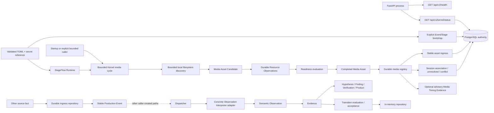

# StageFlow system context

**Baseline:** Accepted Durable Event-Mode Kernel operational foundation after targeted
verification and Green follow-up closure

## System purpose

StageFlow is intended to observe live-event recorded media and supporting production
signals, preserve explainable reasoning and human authority, and eventually coordinate
durable production, editorial, packaging, and delivery workflows. At the current
baseline, it includes a bounded durable Event/Stage/Session/media Kernel, transcription
Work Execution, Editorial review, Packaging Assets, Session Assembly, and the optional
Demo 2 Autonomous Event Node coordinator.[^work][^editorial][^packaging][^assembly][^coordinator]
That foundation is not an event-readiness claim.

## External actors and systems

| Actor or system | Current interaction | Accepted or proposed future boundary |
| --- | --- | --- |
| Developer/operator | Loads validated Kernel configuration, explicitly bootstraps Event/Stages, and invokes application commands | Uses a future authenticated setup/control surface |
| Technical producer/event operations | Reads Kernel Event/Stage/Session/media/recovery status through an API; no UI | Uses future Mission Control and bounded Work Queue workflows from a worker-independent client |
| Editorial reviewer | Can review declared Candidate Moments and create Editorial Clips through human approval.[^editorial] | Richer Editorial review interfaces |
| Marketing user | No implemented workflow | Consumes approved clips, assembled outputs, metadata, and delivery state rather than raw candidate intelligence |
| AI/media Event Worker | A separate transcription worker process claims PostgreSQL-backed work and commits transcript evidence.[^work] | Additional analysis, vision, proxy, or rendering consumers |
| Recording/shared-storage system | Bounded media inspection runs on startup, explicit request, or the enabled coordinator's cadence.[^coordinator] | Remains source of media; StageFlow registers completed assets by reference |
| Schedule/conference system | Provider-neutral program source reconciles a complete Stage snapshot from an offline local schedule file or optional Devcon public-program read into External Program Expectations | Remains source of planned conference data and external identifiers |
| Transcript/vision providers | First local transcription adapter composed by the worker; transcription remains optional and operator-installed.[^work] | Additional providers behind adapters |
| Publishing/delivery destinations | External publication frozen under ADR-0031; no operator action | Future provider-neutral durable operations with idempotency and reconciliation |

An application caller can create a durable human-authorized Session, register media
through the Kernel service, and declare an unreviewed Editorial Candidate Moment. The
Demo controller refuses the retired publication action before any network call under
ADR-0031. The backend Devcon publish adapter remains dormant pending provider-neutral
Delivery design. The controller cannot control a recorder. The Editorial application
boundary now supports human review decisions and approval-created Clips.[^editorial]
Rendering, publication, and delivery remain outside that review foundation
(`docs/plans/editorial-review-foundation.md:85`).

## Current runtime components

| Component | Current responsibility | State/durability |
| --- | --- | --- |
| FastAPI application | Preserve liveness; optionally load Kernel configuration, verify schema, reconcile, and serve bounded read-only Kernel/MTE projections | PostgreSQL authority; process state is composition only |
| Next.js application | Render the read-only Producer operational UI and minimum Editorial shell from explicit fixtures or Kernel/MTE projections | No frontend authority or durable workflow state |
| Shared contracts | IDs, errors, results, clocks, and time ranges | Pure/in-memory values |
| Production Events/adapters | Provider-neutral source event contracts plus stable ingress identity | Completed-asset ingress is composed in the bounded Kernel cycle; general dispatcher paths remain caller-created |
| Dispatcher/interpreters | One structural routing protocol and concrete Event-to-Observation adapters | Caller-created; deterministic synchronous dispatch |
| PostgreSQL ingress adapter | Transactional source-key/fingerprint registration and stable Production Event identity | Durable and freshly validated with isolated PostgreSQL 17.10; deployment remains unapproved |
| Durable Kernel repository | Event/Stage, Program Expectation, Session, media registry/association, completion snapshots, reconciliation, human-command replay, and typed history | Normalized PostgreSQL current state plus typed append-only history |
| Media Timing Evidence repository | Append/retrieve immutable asset-linked Observed facts, Derived intervals, qualification state, and exact application replay | Additive PostgreSQL revision/history authority; advisory only |
| Durable Kernel service | Explicit bootstrap, idempotent human Session boundaries/assignment/completion, readiness/asset adapters, stable ingress, and provenance-bearing categorical association | Direct synchronous application boundary |
| Program schedule sources | `ProgramScheduleSource` composes strict offline JSON (`local_file`) or optional public-program reads (`devcon`); results/status retain provider attribution | Existing PostgreSQL snapshot reconciliation/cache; failed reads preserve the last successful program and never realize Sessions |
| Publication integration | Backend Devcon adapter retained dormant; operator publication is frozen with no action | ADR-0031 freezes external publication pending provider-neutral Delivery design |
| Editorial Candidate Moment repository/service | Idempotent declared Candidate creation, bounded per-Session reads, and append-only boundary-conflict evaluation | PostgreSQL declaration and location-history authority; no in-memory runtime fallback |
| Work Execution / transcription worker | Separate worker process claims transcription Operations, executes through a provider-neutral port, and commits evidence.[^work] | PostgreSQL Operation/Attempt/lease and worker state; migration `0007`.[^work] |
| Editorial review repository/service | Human review decisions, derived review state, and approval-created Editorial Clips.[^editorial] | Append-only PostgreSQL review/Clip history; migration `0011`.[^editorial] |
| Packaging Asset repository/service | Packaging Asset identity, immutable content revisions, and human revision approval.[^packaging] | PostgreSQL revision/decision history; migration `0012`.[^packaging] |
| Session Assembly repository/service | Templates, proposals, frozen revisions, validation, and human approval.[^assembly] | PostgreSQL Assembly authority referencing package and Packaging Asset revisions; migration `0013`.[^assembly] |
| Demo 2 Autonomous Event Node coordinator | Default-off bounded media cycles and Program refresh at configured cadences.[^coordinator] | Process-owned loop under a deployment-scoped PostgreSQL advisory lock; durable records remain authority.[^coordinator] |
| Evidence/reasoning/state policies | Deterministic transformation and transition contracts | Caller-invoked; no orchestrator or durable lineage store |
| In-memory Operational State repository | Atomic accepted Recording/Session state, lineage, revision, and operation replay | Thread-safe and explicitly process-local |
| StageFlow Runtime and Software Agent | Immutable deployment description and explicit synchronous lifecycle | Runtime graph is constructed after Event/Stage authority; lifecycle remains process-local |
| Media collection coordinator | One bounded caller-driven cycle over injected discovery/observation ports | Thread-safe and process-local |
| Bounded Kernel media cycle | Configured discovery, durable resource observations, readiness, asset registration, stable ingress, and association/reconciliation | Synchronous cycle invoked at startup, by a caller, or by the enabled coordinator; PostgreSQL is authority.[^coordinator] |
| Local filesystem discovery adapter | Read-only, shallow, bounded candidate discovery for one explicit binding | Stateless and composed into the Kernel media cycle |
| Readiness and Completed Media Asset contracts | Evaluate supplied objective facts and validate immutable assets; Kernel adapters persist decisions/assets | Callable policy plus durable Kernel registry |

## Current data flow

Solid arrows are directly callable or composed in the bounded Kernel. Dashed arrows mark
other accepted or caller-created reasoning paths that are not composed into the Kernel.
The diagram shows the bounded Kernel path. There is no broker; Work Execution has a
durable transcription worker, and the accepted, default-off Demo 2 coordinator runs
bounded cycles under a PostgreSQL advisory lock.[^work][^coordinator]

## Current persistence and side effects

- PostgreSQL ingress and normalized Kernel tables, repositories, typed history, and
  explicit forward/reversal migrations exist. Work Execution adds PostgreSQL-backed
  Operations, attempts, and leases for transcription.[^work]
- PostgreSQL also preserves immutable human-declared Editorial Candidate Moments and
  append-only Session-boundary location evaluations through migrations 0008 and 0010.
  Editorial review/Clips, Packaging Assets, and Session Assembly add migrations `0011`,
  `0012`, and `0013`, respectively.[^editorial][^packaging][^assembly]
- Loss of PostgreSQL invalidates reconciliation freshness for the live process; restored
  reachability remains recovering/not ready until a fresh bounded reconciliation succeeds.
- Operational State, Agent history, collection history, and operation replay are in
  memory and disappear on process termination.
- Each bounded media-discovery pass performs `stat`/`lstat`/`scandir`-style inspection plus
  one bounded open/read access check. The enabled coordinator repeats these passes at its
  configured cadence; transcription executes separately in the worker.[^coordinator][^work]
  The discovery pass does not decode media, watch, recurse, transfer, alter, or delete
  source media.
- The optional program-read adapter uses the standard-library
  HTTP client for program GETs; the offline local schedule file is the default. The
  retained publish adapter is dormant and the Demo controller refuses publication under
  ADR-0031. These adapters do not participate in the local event-critical media path. The
  selected local transcription adapter uses separately documented model/media dependencies.
  No FFmpeg, model execution, or delivery side effect exists in the Editorial Candidate
  Moment slice.
- HTTP exposes process liveness, read-only Kernel operational status, and bounded
  asset-specific MTE history. Authenticated routes also expose the idempotent `Mark Moment`
  command, human Editorial review with approval-created Clips, bounded per-Session Moment
  reads and the Editorial review queue (`backend/app/api/v1/editorial.py:361`,
  `backend/app/api/v1/editorial.py:389`, `backend/app/api/v1/editorial.py:426`,
  `backend/app/api/v1/editorial.py:466`); Packaging Asset creation, revision, approval, and
  bounded reads (`backend/app/api/v1/assembly.py:220`,
  `backend/app/api/v1/assembly.py:233`, `backend/app/api/v1/assembly.py:254`,
  `backend/app/api/v1/assembly.py:270`, `backend/app/api/v1/assembly.py:292`); Session
  Assembly template, proposal, and approval commands plus bounded template/revision reads
  (`backend/app/api/v1/assembly.py:397`, `backend/app/api/v1/assembly.py:412`,
  `backend/app/api/v1/assembly.py:430`, `backend/app/api/v1/assembly.py:446`,
  `backend/app/api/v1/assembly.py:464`); and the read-only Producer Work Queue
  (`backend/app/api/v1/work_queue.py:136`). These routers share the API-secret dependency
  (`backend/app/api/v1/router.py:14`). Editorial review does not authorize publication.[^editorial]

## Known deployment assumptions

- Python 3.13 with `uv`; FastAPI/Uvicorn for the backend.
- Node/npm with Next.js for the frontend.
- In-memory shared mutable components coordinate threads within their process. The
  separate transcription worker coordinates durable claims and leases through PostgreSQL;
  the Demo 2 coordinator holds a deployment-scoped PostgreSQL advisory lock.[^work][^coordinator]
- Discovery requires an explicitly configured local-file or mounted-volume binding in the
  caller's filesystem namespace.
- The Kernel configuration and durable path do not require Internet access; physical
  event qualification and deployment remain unapproved.
- PostgreSQL is the accepted authoritative store, accessed through Psycopg
  (`docs/architecture/persistence.md:5`, `docs/architecture/persistence.md:17`,
  `backend/pyproject.toml:10`); Redis, a broker, containers, and cloud/provider services
  remain absent from the local event-critical runtime. The optional program-read adapter
  remains outside that path. A separate durable transcription worker and local model
  execution now exist; transcription dependencies are optional, operator-installed, and
  excluded from distributable artifacts under ED-0075.[^work] Shared-secret API
  authentication is implemented (`backend/app/api/authentication.py:16`,
  `backend/app/api/v1/router.py:14`).

## Accepted future boundaries

The implemented direction is one modular monolith with one relational durable store, media
content outside the database by reference, a narrow composition root, startup
reconciliation, and database-backed at-least-once operations only where asynchronous or
external work needs them. The accepted media path is documented in
[segment-lifecycle.md](segment-lifecycle.md). Session authority is documented in
[session-lifecycle.md](session-lifecycle.md). The accepted first operational slice,
component reuse map, and resolved decisions are documented in the
[Durable Event-Mode Kernel architecture](durable-event-mode-kernel.md).
The proposed layer above that foundation, including live intelligence, worker execution,
Session Assembly, scoped approval policy, sequencing, and remaining Yellow decisions, is
documented in the
[Post-Kernel capability architecture](post-kernel-capability-layer.md).

The following are explicitly not approved: microservices, a first-phase broker,
cloud-required event operation, direct live NDI/SDI capture, directories as Sessions,
discovered files as completed assets, Operational State as the Session aggregate, or
automatic machine editorial publication.

## Evidence sources

- [Architecture baseline review](../reviews/architecture-baseline-review.md)
- [Authoritative disposition](../reviews/architecture-baseline-disposition.md)
- [Engineering Directive index](../../ENGINEERING_DIRECTIVES.md)
- `backend/app/main.py`, `backend/app/core/`, and `backend/app/contexts/production/`
- `backend/pyproject.toml`, `frontend/package.json`, and application READMEs
- [Reasoning model](../05_Reasoning_Model.md)

[^work]: Worker adapter composition and polling: `backend/app/demo/worker.py:72` and
    `backend/app/demo/worker.py:156`; provider-neutral execution and evidence commit:
    `backend/app/contexts/work_execution/service.py:42` and
    `backend/app/contexts/work_execution/service.py:101`; durable worker/Operation/Attempt
    schema: `backend/app/infrastructure/postgres/sql/0007_transcription_worker_forward.sql:1`.
    Optional operator-installed distribution boundary: `backend/pyproject.toml:14`.

[^editorial]: Review application boundary: `backend/app/contexts/editorial/service.py:69`;
    review/Clip schema:
    `backend/app/infrastructure/postgres/sql/0011_editorial_review_foundation_forward.sql:1`.
    Append-only history and derived review projection:
    `docs/plans/editorial-review-foundation.md:168`,
    `backend/app/contexts/editorial/contracts.py:304`.
    Scope: `docs/plans/editorial-review-foundation.md:85`.

[^packaging]: Application boundary: `backend/app/contexts/assembly/service.py:37`;
    identity, revisions, approval, and immutable history:
    `backend/app/infrastructure/postgres/sql/0012_packaging_asset_foundation_forward.sql:12`.

[^assembly]: Application commands: `backend/app/contexts/assembly/session_service.py:32`;
    template/revision/validation/approval schema:
    `backend/app/infrastructure/postgres/sql/0013_session_assembly_foundation_forward.sql:9`;
    implementation record: `docs/plans/session-assembly-foundation.md:225`.

[^coordinator]: Accepted bounded runtime: `docs/plans/demo2-autonomous-event-node.md:14`;
    default-off configuration: `backend/app/core/config/deployment.py:219`;
    advisory ownership and bounded cycle scheduling: `backend/app/demo/autonomous.py:167`;
    startup media cycle: `backend/app/bootstrap/event_mode_kernel.py:133`.

Operational deployment, full hardware/media behavior, provider failure, retention, and
conference-scale performance remain unverified beyond the bounded implementation and
recorded qualification evidence. This component inventory does not establish event
readiness. Demo 2 is rehearsal-qualified across Runs 001 and 002
(`docs/validation/README.md:39`), explicitly not Event certification; its live
PostgreSQL-outage leg was not exercised (`docs/validation/results/demo2-hardware-rehearsal-002.md:18`,
`docs/validation/results/demo2-hardware-rehearsal-002.md:22`).
