# StageFlow Architecture Baseline and Consistency Review

**Review date:** 2026-07-22

**Repository:** StageFlow

**Reviewed branch:** `ed/0054-local-filesystem-resource-snapshot`

**Reviewed commit:** `e75b1a4` (`Merge pull request #57 ... ED-0053`)

**Review mode:** Investigation and reporting only

## Classification language

This report uses the following labels deliberately:

- **Observed:** directly verified in repository code, configuration, tests, or documentation.
- **Inferred:** a likely consequence of observed evidence that was not exercised as a complete running system.
- **Intended:** architectural direction supplied for this review or recorded in approved StageFlow documents.
- **Recommended:** a proposed future action; it is not an implemented fact.
- **Open decision:** product or architecture judgment is required before implementation.

Missing future capability is not classified as a defect merely because it appears in the intended direction.

## 1. Executive summary

### Overall architectural health

StageFlow is a healthy, unusually well-tested **domain-contract foundation**, but it is not yet an event-operational media system. The implemented center of gravity is a Python modular monolith containing immutable values, deterministic policies, explicit ports, process-local coordinators, and extensive contract tests. The actually deployed FastAPI application exposes only `GET /api/v1/health`; none of the Production Context runtime, media, reasoning, state, or repository components is composed into application startup.

The repository is therefore internally strongest when assessed against its current Engineering Directive scope. ED-0042 through ED-0053 close several earlier traceability, state-acceptance, runtime, readiness, and bounded-discovery design gaps without pretending to provide persistence, workers, media processing, or delivery. The newer media/runtime contracts consistently use caller-supplied timestamps, bounded operations, typed outcomes, deployment-neutral provenance, and conservative readiness semantics.

The principal architectural risk is sequencing. Several foundational decisions must be made before existing contracts are wired into an at-least-once, restart-safe ingest system: durable Session identity, durable media/operation records, ingress identity and replay behavior, runtime composition, completion/late-media policy, and configuration authority. Implementing watchers, workers, or delivery before those decisions would turn intentional process-local simplifications into operational failure modes.

No Critical or High **current-code defect** was confirmed. Several Medium risks are confirmed at boundaries likely to be used next: incompatible dispatcher/interpreter contracts, nondeterministic IDs for repeated legacy ingress conversion, incomplete timezone invariants, shallow metadata immutability, and a filesystem path time-of-check/time-of-use window. These do not invalidate the present contract-only release, but they should be resolved before those paths become durable or event-facing.

### What the repository currently does well

- **Observed:** The domain is UI-agnostic. Production code has no dependency on FastAPI, Next.js, or frontend modules; only `app/main.py` and the API package depend on FastAPI.
- **Observed:** Provider-specific APIs, cloud SDKs, queues, databases, and media-processing libraries are absent from backend dependencies. This keeps current event-mode contracts locally usable and prevents provider leakage.
- **Observed:** Later EDs distinguish discovery, objective resource facts, readiness evaluation, completed-asset contracts, Production Events, semantic Observations, Evidence, state evaluation, acceptance, and repository commit rather than collapsing them into one ingest manager.
- **Observed:** `SoftwareAgentRuntime`, `MediaCandidateCollectionCoordinator`, and `InMemoryOperationalStateRepository` use locks, immutable snapshots, explicit revisions, typed replay/conflict outcomes, and out-of-lock side-effect publication where applicable.
- **Observed:** Local filesystem discovery is shallow, bounded, read-only, deterministic, rejects traversal/wildcards/credential-bearing references, and does not follow known symlinks.
- **Observed:** The backend suite passes 1,461 tests under strict Pyright and Ruff. Frontend build, lint, and typecheck also pass.

### Most important confirmed risks

1. **ABR-001:** No durable or application-composed production runtime exists; all meaningful state is caller-owned and process-local.
2. **ABR-002:** ADR-0002 says Session is the primary aggregate, but no Session entity, registration boundary, durable lifecycle, or media-to-Session association exists.
3. **ABR-003:** Repeating the same legacy adapter event conversion creates a new Production Event ID, and concrete interpreters create new Observation IDs; an at-least-once ingress path cannot rely on current IDs for deduplication.
4. **ABR-004:** The documented Dispatcher path is not type- or call-compatible with the concrete Observation Interpreters.
5. **ABR-005/006:** Legacy contracts still accept naive timestamps, read the wall clock implicitly, and shallow-freeze nested metadata, while newer ED contracts enforce stronger rules.
6. **ABR-007:** Filesystem scope checks and directory enumeration are path-based separate syscalls, leaving a directory-replacement/symlink race before `scandir` and child inspection.

### Major differences from the intended direction

- Sessions, Events, Stages, segments, jobs, transcripts, human decisions, packages, deliveries, and retention records are not durable domain aggregates.
- Segment discovery exists only as an explicit one-shot adapter call. Monitoring, readiness observation, readiness execution, asset assembly, registration, and reconciliation do not yet exist.
- Incremental reasoning contracts exist, but no runtime invokes or persists them. Hypotheses, Findings, Verification Decisions, and Operational Products are models rather than workflows.
- There are no queues, workers, job claims, retries, migrations, provider implementations, packaging, distribution, archive, or deletion workflows.
- Operator visibility is limited to an always-`ok` liveness endpoint and caller-held in-memory summaries.

### Important areas that could not be verified

- No deployed environment, storage mount, recording system, media corpus, operator workflow, or external provider was available.
- No database schema, migrations, queue broker, worker process, deployment manifest, container configuration, or CI workflow exists to inspect.
- Multi-process and multi-machine behavior cannot be verified because all executable coordination is process-local.
- Performance at conference-scale observation volumes was not benchmarked.
- Authentication, authorization, secret rotation, retention enforcement, and provider retry behavior cannot be evaluated because those capabilities are not implemented.

### Recommended next actions

1. Confirm and record the Session identity/aggregate boundary and its relationship to scheduled activity, observed session candidates, completed media, and final Session products.
2. Define the smallest durable event-mode kernel: operation log/idempotency keys, media registry, candidate/fact persistence, job claims, restart reconciliation, and late-media policy. Keep it inside the modular monolith.
3. Resolve ingress composition before wiring a watcher: one dispatcher-facing Observation Interpreter contract, stable source-event identity, explicit timestamp authority, and durable replay semantics.
4. Define the canonical media flow from candidate to resource observations to readiness to Completed Media Asset to Production Event, including where Session association becomes authoritative.
5. Establish the development-flow foundation described in section 15, then put the existing backend/frontend quality commands in CI.

## 2. Repository and runtime map

### Major modules

| Area | Observed implementation | Runtime status |
| --- | --- | --- |
| `backend/app/main.py`, `api/`, `core/` | FastAPI factory, four environment-backed settings, basic logging, lifespan flag, liveness response | Executable; health only |
| `shared/` | IDs, clock protocol, time range, results, errors, generic domain event | Executable library; not a workflow |
| `contexts/production/production_event`, adapters, interpreters | Source-neutral event and observation contracts plus six concrete Observation Interpreters | Callable contracts; not app-composed |
| Evidence/reasoning packages | Observation-to-Evidence builders, recording/session transition policies, Hypothesis/Finding/Verification/Product models | Callable deterministic components; no orchestrator or store |
| Operational State packages | State taxonomy, acceptance, infrastructure-neutral repository contract, thread-safe in-memory repository | Callable; only repository is process-local |
| Runtime packages | Deployment-neutral Runtime graph and synchronous Software Agent lifecycle | Callable; not started by FastAPI |
| Media packages | Candidate/observation collection coordinator, bounded filesystem discovery, readiness policy, completed-asset contract | Partially executable; stops before readiness execution/asset assembly |
| Other backend contexts | Events, Identity, Editorial, Rendering, Packaging, Publishing, Integration, Simulation | Placeholder README plus empty `__init__.py` |
| Frontend | One static Next.js page reporting foundation status | Executable shell; no backend client or workflows |

The backend contains 392 Python files under `backend/app`, but almost all business-facing files are narrow dataclasses, enums, deterministic policy functions, or explicit in-memory coordinators. This file count should not be mistaken for 392 runtime services.

### Actual runtime processes and entry points

1. **FastAPI process:** `app.main:app`. Startup resolves `Settings`, configures root logging, sets `app.state.ready = True`, and serves `/api/v1/health`.
2. **Frontend process/build:** Next.js App Router with one static page. No API client exists.
3. **Manual/caller-driven production components:** Tests or a future composition root may instantiate the Software Agent, collection coordinator, filesystem adapter, policies, acceptance boundary, and in-memory repository. No command, daemon, scheduled loop, watcher, or worker starts them today.

### Data stores, workers, queues, and providers

- **Observed:** No database dependency, schema, migration, repository implementation other than process-local Operational State, or serialized media registry exists.
- **Observed:** No queue, worker executable, claim table, retry scheduler, outbox, or reconciliation service exists.
- **Observed:** No transcription, analysis, rendering, storage, upload, or conference API provider implementation exists.
- **Observed:** `.env.example` names future `DATABASE_URL`, `REDIS_URL`, `STORAGE_ROOT`, `WHISPER_MODEL`, `JWT_SECRET`, and `DELIVERY_BASE_URL`, but application settings read none of them.

### Implemented domain entities

Implemented first-class values include Production Event, Observation, Evidence, Hypothesis, Finding, Verification Decision, Operational Product, Recording Block, Session Window, Session Window Product, Operational State, Runtime, Agent lifecycle snapshot/transition, Media Asset Candidate, readiness resource observations/evaluation, and Completed Media Asset. Organization, business Event, Stage, Session, Speaker, Clip, Session Package, Delivery, Job, Worker, archive, and retention records are not implemented as entities.

### Core data flows

```mermaid
flowchart LR
    HTTP[FastAPI startup] --> Health[GET /api/v1/health]

    Config[Caller-built StageFlowRuntime] --> Agent[SoftwareAgentRuntime\nprocess-local]
    Agent --> Coordinator[MediaCandidateCollectionCoordinator\nprocess-local]
    Coordinator --> Discovery[LocalFilesystemCandidateDiscoveryAdapter]
    Discovery --> Candidate[MediaAssetCandidate]
    Coordinator --> Facts[Injected resource-observation ports]
    Candidate -. future invocation .-> Readiness[ConservativeAssetReadinessPolicy]
    Facts -. future invocation .-> Readiness
    Readiness -. future assembly .-> Asset[CompletedMediaAsset]
    Asset -. future adapter .-> PE

    Source[Caller-supplied source event] --> Adapter[Adapter contract]
    Adapter --> PE[ProductionEvent]
    PE --> Dispatcher[ProductionEventDispatcher]
    Dispatcher -. incompatible concrete contract .-> Interpreter[Concrete Observation Interpreter]
    PE --> Interpreter
    Interpreter --> Observation[Observation]
    Observation --> Evidence[Evidence builders]
    Evidence --> Policy[Recording / Session transition policy]
    Policy --> Acceptance[Operational State acceptance]
    Acceptance --> Repo[InMemoryOperationalStateRepository]

    Observation -. no runtime orchestration .-> Reasoning[Hypothesis / Finding / Verification / Product contracts]
```

Solid arrows are directly callable paths. Dashed arrows are documented or structurally intended boundaries that are not currently composed.

### Deployment assumptions

- Python 3.13, `uv`, FastAPI/Uvicorn, and a single backend process are the only implemented backend deployment assumptions.
- Current concurrency correctness is limited to threads within one process.
- Local and mounted-volume paths are explicitly configured in caller-created Runtime and discovery bindings.
- The current application requires no internet connection, but it also performs no event production work.
- PostgreSQL, Redis, FFmpeg, Whisper, Docker, and external platforms appear in architectural examples only.

## 3. Evidence and confidence statement

### Direct inspection

The review directly inspected:

- repository status and recent history at commit `e75b1a4`;
- root governance, Product Constitution, ADRs, Engineering Directive index, implementation plan, repository manifest, glossary, domain model, architecture layers, bounded contexts, and integration architecture;
- all application entry points, settings, lifecycle, health, and logging code;
- Python dependency configuration and frontend dependency/scripts configuration;
- Production Context package/file inventory and representative source for every implemented layer;
- runtime lifecycle, collection coordinator, local filesystem discovery, readiness, completed media, transition acceptance, and in-memory repository implementations;
- API and frontend routes;
- test inventory and risk-keyword coverage;
- absence of databases, migrations, workers, queues, provider SDKs, deployment manifests, and CI workflows.

### Commands and checks

- `git status --short --branch`, `git log -5 --oneline --decorate`
- `rg --files`, `find`, `rg`, `sed`, and `nl` evidence queries
- `uv run pytest -o addopts='' -q`: **1,461 passed**, one Starlette/httpx deprecation warning
- `uv run ruff check . --no-cache`: passed
- `uv run pyright`: 0 errors, 0 warnings
- `npm run build`: passed; one static application route plus not-found route
- `npm run lint`: passed
- `npm run typecheck`: passed after permitting TypeScript to write its ignored incremental cache
- `git diff --check`: passed before report creation
- Read-only Python probe: confirmed a legacy `ProductionEvent` accepts naive times and caller mutation of nested metadata remains visible after construction
- Read-only Python probe: confirmed identical `RecordingSessionEvent.to_production_event()` inputs produce equal payloads but different Production Event IDs

### Confidence

Confidence is **high** for repository structure, callable semantics, dependency absence, process-local state, public routes, and test/static-check results. Confidence is **medium** for operational consequences that require a future composition root, external storage behavior, or conference-scale workload. Those consequences are explicitly marked Inferred.

### Documentation/code disagreements

- Root `README.md:226-231` says the implementation is through ED-0052 and concrete filesystem discovery remains future work; ED-0053 is merged and implemented.
- `IMPLEMENTATION_PLAN.md:7-38` still describes the ED-0001 skeleton and only plans through ED-0005.
- Frontend `app/page.tsx:1-5` displays AR-1.2/ED-0003 while repository governance reports AR-2.1/ED-0053.
- Architecture documents describe one database, workers, queues, ingest watching, packages, and delivery as V1 responsibilities; current ED documentation accurately says these are not implemented.
- ADR-0010 uses `TimelineWindowCandidate`; code and tests continue to expose `SessionWindow`, with the Production README explicitly deferring the rename decision.

## 4. Architecture alignment matrix

| Principle | Observed implementation | Status | Evidence | Consequence | Recommended disposition |
| --- | --- | --- | --- | --- | --- |
| Backend-first and UI-agnostic core | Production packages do not import API/frontend/framework code | Aligned | `backend/app/contexts/production/**`; no external imports from `main.py` | Domain logic remains reusable | Leave unchanged |
| Modular monolith | One FastAPI backend and explicit internal contexts | Aligned | ADR-0001; `backend/app/contexts/` | Avoids premature distributed operation | Leave unchanged |
| Production Events as universal ingress | Adapter contracts emit Events, but ED-0052/53 media flow has no Event bridge and concrete interpreters cannot plug into dispatcher | Partially aligned | ADR-0011; dispatcher and media READMEs | Future composition is ambiguous | Resolve before runtime wiring |
| Offline-first event operation | No current cloud dependency; Runtime describes offline policy; no operational pipeline exists | Partially aligned | Runtime contracts; absence of provider SDKs | Offline safety is unproven beyond pure/local calls | Define and system-test event kernel |
| Sessions as primary aggregate | Session-related windows/state candidates exist; no Session entity or repository exists | Misaligned | ADR-0002; class inventory | Media and completion cannot attach to durable Session authority | Architecture decision before Session work |
| Segment-based ingest | Deterministic candidates and completed-segment contract exist | Partially aligned | ED-0048/49/52/53 packages | No durable registration, readiness executor, or reconciliation | Continue in explicit stages |
| File still being written safety | Candidate discovery deliberately does not claim readiness; policy blocks active/growing files when facts are supplied | Mostly aligned | readiness policy/tests | Correct separation, but no concrete fact supplier | Keep boundary; add observer next |
| Duplicate and at-least-once safety | New media candidate identity is deterministic in-process; legacy Event/Observation IDs are fresh; no durable dedup | Partially aligned | local identity code; adapter/interpreter ID generation | Replay after restart cannot be trusted | Define durable source/operation identity |
| Restart recovery | In-memory repository/coordinators are explicitly disposable | Not implemented | repository/runtime/coordinator docstrings | No operational state reconstructs after restart | Required before event use |
| Incremental editorial processing | Models exist through Product; no invocation, revision repository, or human workflow | Not implemented | Hypothesis/Finding/Verification/Product packages | Direction is enabled conceptually, not operationally | Defer implementation pending durable Session/media |
| Human editorial authority | Verification is append-oriented by ADR and contract; no auth/UI/persistence | Partially aligned | ADR-0009; verification models | No path currently bypasses humans, but no workflow exists | Preserve when workflow is built |
| Packaging from durable outputs | Packaging context is placeholder; outputs are not durable | Not implemented | packaging directory; no dependencies | Cannot finalize or package Sessions | Defer until ingest/state durability |
| Provider isolation | No provider-specific dependencies in domain; adapter contracts isolate sources | Aligned | adapter packages and dependency manifests | Good future integration boundary | Leave unchanged |
| Retryable external operations | No external operation implementation or durable attempt record | Not implemented | absence of publishing/delivery code | No current defect; future design needed | Decide before first integration |
| Operational visibility | Only liveness endpoint; no session/segment/job/storage/delivery view | Misaligned | health service and API router | Operators cannot use current app for events | Required before event use |
| Configuration authority | Runtime graph is explicit but caller-built; application reads four unrelated service settings | Partially aligned | `settings.py`; Runtime contracts | No reproducible deployment configuration path | Confirm precedence and loading |
| Security of current external surface | Only health route; no shell/network/provider calls; filesystem discovery bounds paths | Mostly aligned | API inventory; dependency search; discovery tests | Small current attack surface; filesystem race remains | Harden before untrusted storage use |
| Testability and deterministic policy | Extensive behavioral tests; explicit newer timestamps; pure policies | Aligned | 1,461 passing tests | Strong foundation for incremental work | Leave unchanged and add CI |

## 5. Detailed findings

### ABR-001 — Production behavior is not composed or durable

- **Finding type:** Future capability gap
- **Severity:** Medium
- **Recommended timing:** Fix before event use
- **Confidence:** High
- **Affected:** `backend/app/main.py:9-23`; `backend/app/core/lifecycle/lifespan.py:7-10`; `software_agent_runtime/software_agent_runtime.py:125-185`; `media_collection/media_candidate_collection_coordinator.py:164-204`; `operational_state_repository/in_memory_operational_state_repository.py:56-72`
- **Evidence:** FastAPI includes only the health router. A repository-wide search found no Production Context imports outside the Production packages and tests. Agent, coordinator, and repository state are private in-memory snapshots.
- **Observed behavior:** Starting StageFlow sets a ready flag and serves health. It does not create a Runtime, start an Agent, run discovery, invoke reasoning, persist state, reconcile storage, or stop production components on shutdown.
- **Intended direction:** Event-mode operation should survive restarts and make segment/session/work status recoverable.
- **Why it matters:** The contract suite can pass while the application performs none of the media workflow described by the product direction.
- **Concrete scenario:** A machine restarts after a collection cycle. Candidate records, observations, lifecycle revisions, operation replay records, conflicts, and Operational State disappear. Only files remain, and no startup reconciliation rescans them.
- **Recommended disposition:** Define a narrow composition root and durable event kernel before wiring continuous execution. Keep synchronous domain calls; add persistence and scheduling only where recovery requires them.
- **Estimated scope:** Architectural
- **Dependencies:** Session/media identity decisions, persistence technology, operation/idempotency model, configuration authority
- **ADR recommended:** Yes—runtime topology and durable ownership should be explicit.

### ABR-002 — Session is an architectural primary aggregate but not an implemented entity

- **Finding type:** Architectural inconsistency
- **Severity:** Medium
- **Recommended timing:** Include in architecture foundation; fix before the next Session-related feature
- **Confidence:** High
- **Affected:** `ARCHITECTURE_DECISIONS.md:7-13`; `operational_state/operational_state_subject.py:10-22`; `session_transition_policy/session_transition_policy.py:49-58`; `timeline/session_window.py:28-50`; `completed_media_asset/completed_media_asset_context.py:21-75`
- **Evidence:** No `Session` class, registration service, repository, or API exists. Session policy accepts `SESSION_CANDIDATE` and `SESSION_PRODUCT` subjects. Completed Media Asset context deliberately has no Session field.
- **Observed behavior:** StageFlow can reason that a candidate/product subject appears inactive, active, ending, or ended, but it cannot register a Session, associate media to authoritative Session identity, declare a Session complete, or reconstruct one.
- **Intended direction:** Sessions should be first-class entities with registration, stage/source association, active processing, completion, reconciliation, packaging, delivery, and retention history.
- **Why it matters:** Every downstream durable key—transcripts, candidates, human decisions, finalization, delivery—depends on knowing whether Session identity comes from schedule data, observed boundaries, operator choice, or a reconciled product.
- **Concrete scenario:** A scheduled panel starts late and a recorder produces several segments. Current contracts can preserve `scheduled_activity_id`, `recording_block_id`, and a Session candidate state, but there is no authoritative Session record to which the segments and later human decision can attach.
- **Recommended disposition:** Confirm Session identity allocation and reconciliation rules before adding durable ingest or editorial persistence. Do not add a Session ID to every current contract until authority is decided.
- **Estimated scope:** Architectural
- **Dependencies:** Event/Stage ownership, schedule integration, observed Session candidate promotion, late-media rules
- **ADR recommended:** Yes—extend or refine ADR-0002 with identity and lifecycle authority.

### ABR-003 — Legacy observational ingress lacks replay-stable event and observation identity

- **Finding type:** Reliability risk
- **Severity:** Medium
- **Recommended timing:** Fix before the next related feature
- **Confidence:** High
- **Affected:** adapter event `to_production_event()` methods, including `recording_adapter/recording_session_event.py:71-87`; concrete interpreter Observation construction, including `recording_activity_observation_interpreter.py:147-170`
- **Evidence:** Adapter conversions call `EntityId.new()` for each Production Event; concrete interpreters call `EntityId.new()` for each Observation. A read-only probe converted identical source facts twice with the same correlation and timestamps: payloads were equal and IDs differed.
- **Observed behavior:** Re-delivery of logically identical source facts produces distinct lineage IDs unless the caller independently deduplicates before conversion.
- **Intended direction:** Duplicate notifications and at-least-once delivery must not duplicate durable workflow state.
- **Why it matters:** Repository Evaluation idempotency and media candidate identity cannot protect earlier Event/Observation stages if every replay looks new.
- **Concrete scenario:** A recorder reconnects and repeats “recording started.” Two Production Events, Observations, and Evidence items may be generated. Without a durable source key, later policy can treat duplicate corroboration as independent input or create redundant history.
- **Recommended disposition:** Define a source-event identity/idempotency contract. Prefer caller-supplied stable source IDs or a durable adapter operation record; use content-derived IDs only where authoritative facts and collision policy are explicit.
- **Estimated scope:** Medium
- **Dependencies:** Adapter source capabilities, durable ingress store, provider replay semantics
- **ADR recommended:** Yes if one identity strategy governs all ingress adapters.

### ABR-004 — Dispatcher and concrete Observation Interpreters are not composable

- **Finding type:** Architectural inconsistency
- **Severity:** Medium
- **Recommended timing:** Fix before the next related feature
- **Confidence:** High
- **Affected:** `dispatcher/production_event_dispatcher.py:22-77`; `interpreter/production_event_interpreter.py:31-79`; `observation_interpreter/observation_interpreter.py:56-125`; all concrete `*observation_interpreter.py` packages
- **Evidence:** The dispatcher requires `ProductionEventInterpreter`, calls `can_interpret(event)`, and passes one `InterpreterContext`. Concrete interpreters expose `can_interpret_event`, accept an Event or Event sequence plus `ObservationInterpreterContext`, and return a different result type.
- **Observed behavior:** The documented `Production Event -> Dispatcher -> Observation Interpreter` flow cannot use the concrete interpreters without an adapter or type bypass. Existing dispatcher tests use only the older generic interpreter.
- **Intended direction:** Dispatch should route universal ingress to the concrete Perception Layer without duplicating dispatchers or weakening strict typing.
- **Why it matters:** The first composition root would otherwise invent an unreviewed integration abstraction at the most important ingress boundary.
- **Concrete scenario:** Registering `RecordingActivityObservationInterpreter` with `ProductionEventDispatcher` fails static typing and lacks the methods/result expected by `dispatch()`.
- **Recommended disposition:** Select one small dispatcher-facing protocol and adapt one side. Preserve batch interpretation only if it has a demonstrated semantic need; do not reorganize all packages for naming consistency.
- **Estimated scope:** Medium
- **Dependencies:** runtime composition and batch/fan-out semantics
- **ADR recommended:** No, unless the decision changes event delivery guarantees.

### ABR-005 — Timestamp authority is inconsistent across contract generations

- **Finding type:** Reliability risk
- **Severity:** Medium
- **Recommended timing:** Fix before the next related feature
- **Confidence:** High
- **Affected:** `production_event/production_event.py:26-46`; `observation/observation.py:22-72`; `evidence/evidence_set.py:26-48`; `transition_policy/transition_evaluation.py:26-55`; `operational_state/operational_state.py:48-79`; recording/session transition policies; shared `time/clock.py`
- **Evidence:** At least 27 production locations call `datetime.now(UTC)` directly or through a default. Legacy event, observation, evidence, and evaluation dataclasses do not reject naive timestamps. A probe constructed a naive Production Event successfully. By contrast, ED-0046+ repository/media/runtime contracts require explicit aware timestamps and often prohibit implicit clocks. The shared `Clock` protocol is used only by shared-contract tests.
- **Observed behavior:** Equivalent callers can create aware or naive legacy values, mixed comparisons can raise `TypeError`, `.timestamp()` can use host timezone for naive values, and omitted values use the process wall clock rather than an explicit evaluation clock.
- **Intended direction:** Event, observation, evaluation, acceptance, commit, and organizational anchor times should be explicit and semantically distinct, especially across machines.
- **Why it matters:** Replay and ordering can differ by host, and implicit construction times become difficult to reconstruct after persistence.
- **Concrete scenario:** One source emits a naive timestamp while another emits UTC-aware time. Session boundary sorting or a `received_at < occurred_at` comparison fails with a Python exception instead of a typed domain outcome.
- **Recommended disposition:** Establish an ingress normalization rule and aware-time invariant for externally supplied domain facts. Route runtime-generated “now” through an explicit clock/composition boundary. Preserve distinct timestamp roles; do not normalize by silently attaching UTC.
- **Estimated scope:** Medium
- **Dependencies:** serialization format, source adapter policy, migration/compatibility inventory
- **ADR recommended:** Yes for timestamp authority and normalization.

### ABR-006 — Many frozen contracts expose mutable nested metadata

- **Finding type:** Reliability risk
- **Severity:** Medium
- **Recommended timing:** Fix before the next related feature
- **Confidence:** High
- **Affected:** 123 Production Python files using `MappingProxyType(dict(self.metadata))`, including Production Event, Observation, Evidence, Transition Evaluation, Hypothesis, Finding, Verification, and Product contracts
- **Evidence:** Top-level mappings are copied and wrapped, but nested dictionaries/lists remain caller-owned. A probe appended to a caller list after Production Event construction and the supposedly frozen Event changed. Newer runtime/readiness/media packages use recursive freeze helpers, demonstrating inconsistent contract generations.
- **Observed behavior:** Frozen dataclass equality, summaries, context extraction, and policy inputs may change after construction through nested metadata references.
- **Intended direction:** Durable reasoning and lineage values should be immutable and replayable; metadata should remain supplementary where possible.
- **Why it matters:** Some legacy semantics and compatibility context are still read from metadata. Indirect mutation can change behavior without a new domain event or revision.
- **Concrete scenario:** An adapter reuses and mutates a nested metadata dictionary after an Observation is retained. A later Evidence build sees different semantic/context values than the earlier build from the same Observation object.
- **Recommended disposition:** Inventory accepted metadata value types and adopt the existing recursive freeze pattern at persistence/reasoning boundaries. Avoid a generic serialization framework and retain compatibility only where non-JSON values are intentional.
- **Estimated scope:** Medium
- **Dependencies:** metadata type inventory and compatibility tests
- **ADR recommended:** No; a focused contract hardening directive is sufficient.

### ABR-007 — Filesystem discovery has a path replacement race

- **Finding type:** Security concern
- **Severity:** Medium
- **Recommended timing:** Fix before event use
- **Confidence:** High for the syscall window; Medium for exploitability in the intended deployment
- **Affected:** `local_filesystem_discovery/local_filesystem_candidate_discovery_adapter.py:131-219`, `:368-489`, and `:884-893`
- **Evidence:** Ancestor checks, target `lstat`, `os.scandir(path)`, and child `lstat(path)` are separate path-based operations. `scandir` follows a target symlink if the checked directory is replaced after `lstat`. Tests cover static symlinks and traversal but not replacement between syscalls.
- **Observed behavior:** Known symlinks are blocked, but the adapter does not bind enumeration to the object that passed validation or revalidate target device/inode after enumeration.
- **Intended direction:** Configured scope must not be escaped, and duplicate/renamed/storage-churn behavior should remain safe.
- **Why it matters:** On a writable shared mount, a cooperating process can replace a checked directory with a symlink or different directory before enumeration. Ordinary mount churn can create a similar identity mismatch without malicious intent.
- **Concrete scenario:** `/ingest/stage-a` passes `lstat`; it is renamed and replaced by a symlink to another tree; `scandir('/ingest/stage-a')` enumerates that tree and returns candidates that were outside the checked object.
- **Recommended disposition:** Use descriptor-relative enumeration/stat where supported, or capture and revalidate target identity before returning candidates and reject any change. Document platform limitations and keep later content access independently identity-safe.
- **Estimated scope:** Medium
- **Dependencies:** supported operating systems/filesystems and future snapshot observer design
- **ADR recommended:** No.

### ABR-008 — The media path ends before a durable completed asset

- **Finding type:** Future capability gap
- **Severity:** Medium
- **Recommended timing:** Fix before event use
- **Confidence:** High
- **Affected:** ED-0048 through ED-0053 packages and READMEs
- **Evidence:** ED-0053 discovers candidates; ED-0052 can collect facts from injected ports; ED-0049 evaluates supplied facts; ED-0048 validates a supplied asset. There is no concrete resource observation port, readiness executor, asset assembler, asset repository/registry, or Completed Media Asset-to-Production Event adapter.
- **Observed behavior:** A local file can become a deterministic candidate, but StageFlow cannot currently prove it stable, register it as completed, associate it with a Session, or emit it into observational reasoning.
- **Intended direction:** Completed segments should be detected, validated, registered, processed incrementally, and reconciled safely.
- **Why it matters:** This is the next natural implementation path; crossing several boundaries in one watcher would bypass the deliberate contract separation already established.
- **Concrete scenario:** A recorder writes `segment-0042.mov`. Discovery returns a candidate even while it is zero bytes or active. No runtime component samples size/write/read/presence, invokes readiness, constructs the manifest, or saves the outcome.
- **Recommended disposition:** Implement in reversible steps: one-shot objective snapshot observation, explicit readiness invocation, deterministic asset assembly, durable media registry, then asset-availability Event emission. Preserve ED-0049 as the sole readiness authority.
- **Estimated scope:** Large
- **Dependencies:** durable identity, persistence, Session association, reconciliation, file-race hardening
- **ADR recommended:** Yes for ownership and durable transition points, not for each adapter.

### ABR-009 — Jobs, claims, retries, and reconciliation do not exist

- **Finding type:** Future capability gap
- **Severity:** Medium
- **Recommended timing:** Include in architecture foundation; implement before long-running processing
- **Confidence:** High
- **Affected:** repository-wide; Production, rendering, transcription, packaging, publishing, and scripts/deployment areas
- **Evidence:** No Job/Task/Worker entity, queue dependency, claim/lease operation, retry schedule, attempt record, dead-letter state, reconciliation command, or worker entry point exists. Current retry-like behavior is same-instance operation replay only.
- **Observed behavior:** All executable work is synchronous and caller initiated. Exceptions become typed partial/failure outcomes in several coordinators, but no component owns the next attempt.
- **Intended direction:** Transcription, analysis, rendering, packaging, upload, and delivery should be deferrable, retryable, and observable; at-least-once delivery should be safe.
- **Why it matters:** Long-running or network-dependent work cannot be made reliable by wrapping current calls in an ad hoc loop; durable ownership and claim semantics are required.
- **Concrete scenario:** A transcription process terminates after the provider completes but before local result persistence. There is currently no attempt record, idempotency key, claim expiry, or reconciliation path to decide whether to retry or recover the result.
- **Recommended disposition:** Define one durable operation/attempt model and a simple database-backed worker loop inside the modular monolith. Do not introduce microservices or a broker until measured concurrency requires them.
- **Estimated scope:** Architectural
- **Dependencies:** persistence selection, provider idempotency, payload storage, operation identity, observability
- **ADR recommended:** Yes.

### ABR-010 — Packaging, distribution, archive, and retention are placeholders

- **Finding type:** Future capability gap
- **Severity:** Low
- **Recommended timing:** Defer until capability is needed
- **Confidence:** High
- **Affected:** `contexts/packaging`, `rendering`, `publishing`, `integration`; Product Constitution retention principle; integration architecture
- **Evidence:** Each non-Production context contains only an empty initializer and three-line README. No package, manifest-of-deliverables, export, destination, delivery attempt, archive, or deletion authorization implementation exists.
- **Observed behavior:** Completed Media Asset manifests describe an individual logical asset, not a Session Package or delivery manifest. Operational Products are generic contracts and are not persisted.
- **Intended direction:** Final packaging should reuse durable incremental outputs, and external operations should have trackable, safely retryable attempts.
- **Why it matters:** This is not a current defect, but provider-specific delivery must not become the first durable workflow model and leak backward into the domain.
- **Concrete scenario:** A Session ends with three approved clips and a transcript. There is no package record, completeness check, destination payload, upload attempt, delivery receipt, or archive manifest.
- **Recommended disposition:** Defer implementation. Before the first destination integration, define provider-neutral Package/Delivery/Attempt records and an outbox or equivalent commit boundary.
- **Estimated scope:** Large
- **Dependencies:** durable Session, media, editorial decisions, jobs, provider integration policy
- **ADR recommended:** Yes when delivery ownership is selected.

### ABR-011 — Operational visibility is limited to process liveness

- **Finding type:** Missing current requirement
- **Severity:** Medium
- **Recommended timing:** Fix before event use
- **Confidence:** High
- **Affected:** `core/health/service.py:6-16`; `api/v1/health.py:6-11`; `core/logging/configure.py:1-7`; Runtime/Agent summaries
- **Evidence:** `get_health()` always returns `status='ok'` and the service ID. Lifespan sets `app.state.ready = True` but health does not read it and shutdown does not set it false. There are no application log calls, structured logging fields, metrics, traces, storage checks, worker checks, or operator APIs.
- **Observed behavior:** Operators can determine only that the HTTP process answered. Runtime and coordinator summaries are available only to code holding those in-memory objects.
- **Intended direction:** Operators should see active Sessions, segment states, worker/storage/network health, retries, finalization safety, and delivery status.
- **Why it matters:** Silent or ambiguous failure during an event is more damaging than an explicit degraded state.
- **Concrete scenario:** The shared volume disconnects while HTTP remains alive. Health continues to report `ok`; no status reports target accessibility, pending media, or required intervention.
- **Recommended disposition:** Keep liveness simple, add distinct readiness/dependency health once components are composed, and derive operator views from durable domain/operation state rather than logs. Add correlation IDs to structured logs at boundaries.
- **Estimated scope:** Large over time; small for liveness/readiness separation
- **Dependencies:** composition root, durable state, storage/worker/provider health contracts
- **ADR recommended:** No for endpoint details; yes only if defining system-wide health authority.

### ABR-012 — Application configuration has no production authority or precedence model

- **Finding type:** Open architectural decision
- **Severity:** Medium
- **Recommended timing:** Include in architecture foundation
- **Confidence:** High
- **Affected:** `core/config/settings.py:7-25`; `.env.example:1-11`; Runtime configuration contracts
- **Evidence:** FastAPI reads four `STAGEFLOW_*` service fields directly with `getenv` and caches them. Full `StageFlowRuntime` graphs, filesystem bindings, limits, event mode, readiness routes, and resource policies must be constructed by an external caller that does not exist. `.env.example` lists six unused future settings.
- **Observed behavior:** There is no file/env/CLI precedence, configuration schema version loader, secret provider, startup validation report, effective-config inspection, or immutable deployment snapshot.
- **Intended direction:** Event deployments should be reproducible, inspectable, event-agnostic, and safe with credentials and offline modes.
- **Why it matters:** Without one authority, a future command may invent local defaults that disagree with the explicit ED-0050 Runtime graph.
- **Concrete scenario:** Two stage machines receive different mount paths or readiness intervals. Current code has no supported way to load, compare, validate, or report their effective configuration.
- **Recommended disposition:** Decide one startup configuration boundary and precedence order. Load into the existing immutable Runtime contracts, validate once, expose a redacted summary, and keep secrets as opaque references rather than metadata.
- **Estimated scope:** Medium
- **Dependencies:** deployment topology, configuration transport, secrets mechanism
- **ADR recommended:** Yes.

### ABR-013 — Session/candidate vocabulary conflicts with an approved ADR

- **Finding type:** Documentation mismatch
- **Severity:** Medium
- **Recommended timing:** Fix before the next related feature
- **Confidence:** High
- **Affected:** ADR-0010; `timeline/session_window.py`; Production README; media candidate and Operational State subject contracts
- **Evidence:** ADR-0010 declares `TimelineWindowCandidate` as the pre-verification concept and distinguishes it from `SessionWindowProduct`. Code/tests still expose `SessionWindow`, whose statuses include both proposed and verified. Separately, `MediaAssetCandidate`, `SESSION_CANDIDATE`, `EDITORIAL_CANDIDATE`, and Candidate Moment mean different things.
- **Observed behavior:** “Session window” can mean a proposed timeline candidate, a verified range, or a downstream product depending on type. “Candidate” alone is not a safe cross-module term.
- **Intended direction:** Vocabulary should preserve reasoning versus verified product, storage versus editorial object, and scheduled versus observed Session authority.
- **Why it matters:** Persistence/API design will turn naming ambiguity into incompatible schemas and endpoint semantics.
- **Concrete scenario:** A future endpoint named `/session-windows` cannot tell clients whether it returns machine proposals, human-verified selections, Operational Products, or authoritative Sessions.
- **Recommended disposition:** Confirm canonical names in the domain glossary before serialization. Prefer qualified names (`MediaAssetCandidate`, `TimelineWindowCandidate`, `SessionCandidateState`, `SessionWindowProduct`) and provide compatibility aliases if renaming public Python contracts.
- **Estimated scope:** Medium
- **Dependencies:** Session identity decision and API/storage compatibility policy
- **ADR recommended:** Update ADR-0010 or record why implementation intentionally differs.

### ABR-014 — Baseline documentation and visible release status are stale

- **Finding type:** Documentation mismatch
- **Severity:** Low
- **Recommended timing:** Include in architecture foundation
- **Confidence:** High
- **Affected:** root README current status, `IMPLEMENTATION_PLAN.md`, frontend landing page, `.env.example`, architecture status notes
- **Evidence:** Root README stops at ED-0052 and says concrete filesystem discovery is future; ED-0053 is merged. The implementation plan describes ED-0001. The frontend displays AR-1.2/ED-0003. Older architecture documents mix current-tense V1 responsibilities with clarifying notes that defer them.
- **Observed behavior:** A new contributor cannot identify the authoritative current baseline without reading the Engineering Directive table and many package READMEs.
- **Intended direction:** Durable architecture and development instructions should distinguish implemented, approved future, legacy, and superseded material.
- **Why it matters:** Stale documents encourage work against the wrong release boundary and can make intentional omissions appear accidental.
- **Concrete scenario:** A contributor trusts README and proposes “first filesystem discovery” even though ED-0053 already provides it, or assumes PostgreSQL/Redis workers exist because the architecture layer document lists them.
- **Recommended disposition:** After this audit is accepted, update status documents in a dedicated documentation change. Preserve history; add explicit `Current`, `Intended`, and `Legacy` markers instead of rewriting specifications to match code.
- **Estimated scope:** Small to Medium
- **Dependencies:** architecture direction confirmation
- **ADR recommended:** No.

### ABR-015 — Strong tests are manual-only and system-risk coverage is absent

- **Finding type:** Maintainability concern
- **Severity:** Medium
- **Recommended timing:** Include in architecture foundation
- **Confidence:** High
- **Affected:** `.github/workflows/README.md`; backend and frontend test configuration
- **Evidence:** 1,461 backend tests, Ruff, Pyright, frontend build/lint/typecheck pass locally. No CI workflow exists. The frontend has no test runner. Many architecture exclusion tests inspect names/source text; no deployed-system, restart, multi-process, mount-fault, or provider-fault tests can exist yet.
- **Observed behavior:** Contract regressions are well defended when developers run the documented commands. Merge-time enforcement and operational behavior are not verified.
- **Intended direction:** Risk-based tests should cover duplicates, active writes, interruption, restart, late media, offline operation, provider outages, finalization, and delivery.
- **Why it matters:** As composition begins, source-string assertions cannot prove recovery or side-effect semantics, and manual-only checks are easy to omit.
- **Concrete scenario:** A pull request breaks frontend typecheck or a cross-package contract but is merged because no automation executes the quality matrix.
- **Recommended disposition:** Add a small CI matrix for current commands. Add behavior-first integration/fault tests only as the corresponding durable components are introduced; keep exclusion scans as supplementary tripwires.
- **Estimated scope:** Small for CI; ongoing for system tests
- **Dependencies:** repository automation approval and future runtime components
- **ADR recommended:** No.

### ABR-016 — Newer runtime/media boundaries are conservative and internally coherent

- **Finding type:** Positive observation
- **Severity:** Observation
- **Recommended timing:** Leave unchanged
- **Confidence:** High
- **Affected:** ED-0046 through ED-0053 implementations and tests
- **Evidence:** Explicit aware request times, immutable deep-frozen metadata, deterministic IDs/order, typed limitations, bounded calls, stale-revision checks, in-process replay, thread-safe snapshots, and distinct evaluation/acceptance/commit timestamps are all covered behaviorally.
- **Observed behavior:** Discovery does not claim readiness; readiness does not access files; assets do not infer Session identity; repositories do not run policy; Runtime profile is provenance rather than trust or identity.
- **Intended direction:** Predictable recovery foundations, explainability, and backend/UI neutrality.
- **Why it matters:** These separations make later persistence and orchestration easier to add without reinterpreting existing facts.
- **Concrete scenario:** A Development Runtime discovers the same source facts as Agent/Node without changing candidate identity, while its first-class provenance remains exact.
- **Recommended disposition:** Preserve these boundaries. Add composition around them rather than folding them into a watcher or manager.
- **Estimated scope:** None
- **Dependencies:** None
- **ADR recommended:** No.

### ABR-017 — Provider isolation and present-day offline safety are strong

- **Finding type:** Positive observation
- **Severity:** Observation
- **Recommended timing:** Leave unchanged
- **Confidence:** High
- **Affected:** backend dependency manifest, adapter contracts, Runtime event-mode policy, local discovery, empty integration contexts
- **Evidence:** Backend runtime dependencies are FastAPI, Pydantic, and Uvicorn only. No provider SDK, network client, subprocess, shell execution, FFmpeg, transcription model, database, queue, or cloud storage call exists in production code. Local discovery reads metadata only.
- **Observed behavior:** Current domain/runtime contract operations can execute without internet access. No provider-specific schema leaks into core values.
- **Intended direction:** Local production must not depend on continuous connectivity; integrations should remain behind adapters.
- **Why it matters:** The project can choose cloud enhancements later without making them event-critical.
- **Concrete scenario:** Internet loss cannot break the current local policy and discovery calls because they make no network request.
- **Recommended disposition:** Keep network-dependent work explicitly classified and deferrable when it is introduced. Do not interpret this observation as proof that a complete offline event workflow exists.
- **Estimated scope:** None
- **Dependencies:** Future integrations
- **ADR recommended:** No.

## 6. Current Session lifecycle

### What represents a Session today

There is no authoritative `Session` entity, registration command, repository, or API. Session meaning is distributed across narrower contracts:

- `SessionWindow` carries a proposed or verified time range.
- `SessionWindowProduct` is a reasoning output, not the business aggregate described by ADR-0002.
- Operational State provides `SESSION_CANDIDATE` and `SESSION_PRODUCT` subject types and `inactive`, `active`, `ending`, and `ended` state values.
- The Session transition policy evaluates Evidence against a caller-supplied prior state, and the acceptance/repository boundary can retain the resulting Operational State in memory.
- `CompletedMediaAsset` intentionally does not infer or require a Session association.

### Ownership, persistence, recovery, and completion

| Question | Observed answer | Consequence |
| --- | --- | --- |
| Who creates a Session? | No implemented owner or creation path | Scheduled and observed identities cannot converge on one authority |
| What owns current state? | The caller supplies prior state; an optional in-memory repository stores accepted state | Ownership is process-local and composition-dependent |
| How is it persisted? | Only accepted Recording/Session Operational State can be committed to the in-memory repository | No durable Session row, event log, or aggregate revision exists |
| How is it recovered? | It is not recovered after process termination | Restart loses accepted state and replay records |
| What means complete? | The transition policy can propose `ended`; this is not equivalent to media completeness, editorial finalization, packaging, or delivery | “Session ended” cannot safely trigger final output without additional policy |
| How are late facts handled? | Evaluation and stale-revision contracts exist, but no durable late-fact workflow exists | A restart or delayed segment has no reconciliation owner |

The current state contracts correctly keep transition evaluation, acceptance, repository commit, and organizational anchor times distinct. That precision should be preserved when a durable Session aggregate is introduced.

### Required Session decisions

Before implementation, confirm the stable Session ID authority; the relationship between scheduled activity, observed Session candidates, verified windows, and authoritative Session products; Event and Stage associations; source/room associations; and whether `ended`, `media complete`, `editorially final`, `packaged`, and `delivered` are separate milestones. The recommended default is that they remain separate.

## 7. Current segment/media lifecycle

### Discovery and identity

Local filesystem discovery is an explicit one-shot call. It validates a configured binding, enumerates only immediate child files up to a bound, reads metadata, sorts results deterministically, and constructs immutable `MediaAssetCandidate` values. It does not watch, poll, open media content, calculate hashes, or claim readiness.

Candidate identity is deterministic from authoritative source facts, including Runtime/source identity and normalized resource identity. Deployment profile is provenance only and does not change identity. The coordinator deduplicates by Candidate ID and records operation replay/conflict outcomes only in memory.

Path and stable-object facts are both represented. Because normalized location participates in the current seed, a rename can produce a new Candidate ID even when the filesystem object token remains stable. This is consistent with the current documented seed, but rename continuity and durable aliasing remain an open ingest decision.

### Readiness and registration

Discovery candidates may refer to active or zero-byte files. This is intentional: eligibility for observation is not readiness. `ConservativeAssetReadinessPolicy` can evaluate explicitly supplied facts such as size stability, observation timing, active-write indicators, and limitations. No concrete observation supplier, repeated observation scheduler, readiness executor, Completed Media Asset assembler, or media registry invokes that path today.

There is no durable step that assigns a Candidate to a Session, registers a Completed Media Asset, emits a Production Event, or records a segment as processed. Late segments, moved files, duplicate mount views, and post-restart rediscovery therefore have deterministic facts but no operational reconciliation owner.

| Lifecycle dimension | Observed behavior |
| --- | --- |
| State | Candidate, observation bundle/readiness evaluation, and Completed Media Asset are separate immutable contracts; no durable segment state machine joins them |
| Duplicate handling | Deterministic IDs and process-local maps suppress equivalent candidates during one coordinator lifetime; durable duplicate/rename reconciliation does not exist |
| Processing | No media probe, transcription, analysis, render, or processing job is invoked by discovery |
| Retry | Calls return typed limitations/conflicts; no persisted retry schedule or owner exists |
| Restart recovery | Candidate and operation history disappear; unchanged files could be rediscovered only if a caller explicitly scans again |
| Session association | None is authoritative; Completed Media Asset deliberately does not infer Session identity |
| Late/out-of-order behavior | Discovery order is deterministic, but no Session-relative ordering, watermark, grace window, or late-media policy exists |

### Current lifecycle summary

```mermaid
flowchart LR
    Binding[Explicit local binding] --> Discover[One bounded shallow scan]
    Discover --> Candidate[MediaAssetCandidate\nprocess-local collection]
    Candidate -. missing observer .-> Facts[Resource observations]
    Facts -. caller may invoke .-> Ready[Readiness evaluation]
    Ready -. missing assembler/registry .-> Asset[CompletedMediaAsset]
    Asset -. missing association/event bridge .-> Session[Authoritative Session]
    Session -. missing workflows .-> Final[Finalization / Package / Delivery]
```

## 8. Domain vocabulary and ambiguity review

| Term | Observed meaning | Locations | Ambiguity or conflict | Recommended disposition | Urgency |
| --- | --- | --- | --- | --- | --- |
| Event | Usually `ProductionEvent`; root docs also use business Event | ADR-0011; `production_event/`; root domain/architecture docs | Technical ingress envelope versus conference Event | Always qualify business Event and Production Event in APIs/schemas | Before persistence/API |
| Production | Main operational bounded context and event-time work | `contexts/production/`; Product Constitution | Can sound like deployment environment | Retain context name; qualify “production environment” separately | Low |
| Session | Intended primary aggregate; currently only windows, state subjects, policies, and products | ADR-0002/0010; `timeline/`; `session_transition_policy/`; Operational State packages | Scheduled Session, observed candidate, verified product, and lifecycle state are not unified | Decide aggregate authority and glossary definition | Immediate architecture |
| Stage | IDs/context values only; no aggregate | Runtime, Event context, and architecture docs | Physical room, program track, or Stage entity | Define whether Stage is managed reference data or an aggregate | Before Session schema |
| Source | Adapter/source identity and media provenance | Event adapters; `local_filesystem_candidate_discovery/`; media contracts | Device, application, mount, stream, or event source | Use qualified source kinds and opaque stable source IDs | Before ingress |
| Recording | Recording block, recording state, source events | `recording_block/`; `recording_transition_policy/`; Event adapters | Activity, device stream, or file | Keep Recording Block and Recording Operational State distinct | Before persistence |
| Segment | Architectural ingest unit; no entity with this exact canonical name | Product Constitution; ADR-0003; media READMEs | Media Candidate, resource, chunk, and completed asset overlap | Define durable segment/media-record lifecycle without changing existing facts | Before media registry |
| Chunk | Architecture says storage boundary | ADR-0003 and older architecture docs | Often used editorially as clip | Reserve for physical/storage segmentation per ADR-0003 | Now in glossary |
| Clip | Placeholder Editorial concept | `contexts/editorial/README.md`; product docs | Could be source slice, render, or published object | Reserve for editorial selection/output, not ingest file | Before Editorial work |
| Asset | `CompletedMediaAsset` is immutable completed source-media contract | `completed_media_asset/`; `media_asset_candidate/` | Could be candidate, derived render, or deliverable | Use `MediaAssetCandidate`, `CompletedMediaAsset`, and rendered/delivery asset explicitly | Before APIs |
| Marker | Mentioned in product direction; no implementation | Product/domain/architecture docs | Could be source cue, observation, or editorial annotation | Define only when marker workflow is scoped | Deferred |
| Moment | Candidate Moment appears in editorial vocabulary | Editorial/product docs | “Candidate” collides with media candidates | Always qualify `CandidateMoment` as editorial | Before Editorial API |
| Highlight | Product/output concept only | Product Constitution and Editorial docs | Could mean detected moment, approved edit, or rendered clip | Split detection, approval, and output states | Deferred |
| Candidate | Used for media assets, Session state subjects, and editorial concepts | `media_asset_candidate/`; Operational State taxonomy; Editorial docs | Generic name loses domain and confidence meaning | Require qualified names at boundaries | Before serialization |
| Transcript | Intended derived artifact; no contract/store | Product and architecture docs | Live partial versus final transcript unresolved | Define revision and provider provenance before implementation | Feature-enabling |
| Package | Intended Session deliverable; placeholder context | `contexts/packaging/README.md`; architecture docs | Build plan, manifest, archive, and published package may differ | Model package revision and manifest separately | Before packaging |
| Manifest | Mentioned in architecture; no schema | Packaging/publishing architecture docs | Input inventory versus delivery manifest | Define immutable package manifest after durable outputs | Deferred |
| Job | Intended retryable work; no entity | Architecture layer/integration docs | Domain operation, queue message, and provider attempt can diverge | Use durable operation/job/attempt vocabulary with explicit semantics | Before workers |
| Task | No canonical domain contract | General documentation only | Risks collision with async task/process implementation | Avoid as business noun unless defined | Low |
| Node | Deployment profile/runtime participant | ED-0050 Runtime contracts and docs | Not a trust or identity tier | Retain as provenance; do not encode authority | Leave unchanged |
| Agent | Software Agent runtime participant/profile | `software_agent_runtime/`; ED-0050/51 docs | Could mean process, capability, identity, or AI agent | Use Software Agent for runtime and separate provider/model terms | Before composition |
| Worker | Intended execution process; no implementation | Architecture/deployment docs | Could be Runtime node, thread, or queue consumer | Reserve for execution topology, not domain authority | Before workers |
| Observation | Semantic statement interpreted from a Production Event | `observation/`; `observation_interpreters/` | Could be confused with media resource measurement | Keep `Observation` and `MediaResourceObservation` qualified | Now in glossary |
| Evidence | Derived support for transition/reasoning | Evidence builder/model packages | No durable lineage store | Preserve provenance and immutability in future store | Before persistence |
| Operational State | Accepted state for a subject/revision | Operational State policy/acceptance/repository packages | Not equivalent to Session aggregate or workflow status | Keep it as a projection/fact, not the aggregate itself | Immediate architecture |

## 9. Module boundaries and dependency review

### Boundaries to preserve

- Production-domain contracts do not import HTTP, frontend, cloud, storage, or provider frameworks.
- Discovery, resource observation, readiness, asset construction, event interpretation, evidence building, transition evaluation, acceptance, commit, and notification are separate boundaries.
- Later ED implementations use explicit ports and immutable result values instead of global managers.
- Cross-context packages outside Production are placeholders, so they do not yet leak implementation concerns into Production.
- Locks protect shared process-local state, snapshots are copied, and notification publication occurs outside repository mutation locks.

### Boundaries that need correction before composition

- `ProductionEventDispatcher` and concrete Observation Interpreters expose incompatible method, context, and result contracts (ABR-004).
- The ED-0052/0053 media flow has no explicit bridge to Completed Media Asset registration or Production Event ingress (ABR-008).
- Caller-created Runtime, Agent, coordinator, repositories, ports, and settings have no application composition authority (ABR-001/012).
- Legacy Event/Observation identity, time, and metadata behavior differs from newer media/runtime contracts (ABR-003/005/006).

### Dependency direction

The intended direction—API and infrastructure depending inward on application/domain contracts—is mostly respected because infrastructure is minimal. The main issue is absence, not inversion: no application service composes use cases, and the only repository implementation is stored within the Production package as an explicitly non-durable adapter.

No package split, microservice extraction, or generic “manager” layer is recommended. Preserve direct pure-policy calls and narrow ports. Add a small application/composition layer only for transaction ownership, durable operation boundaries, scheduling, reconciliation, and side-effect publication.

No circular import failure or UI-to-domain ownership leak was observed. Shared mutable state is limited to explicitly locked process-local Runtime/coordinator/repository objects; it becomes a scaling boundary, not an unprotected race inside the tested single process. Filesystem infrastructure is isolated behind the candidate-discovery port, and provider-specific data does not leak into domain models.

Likely future bottlenecks are coordination and durability rather than Python call structure: one-process locks cannot coordinate multiple workers, complete collection summaries grow in memory, and no store can page/query historical lineage. Address those only with the first representative workload and durable schema. Components that should remain unchanged are the pure policies/builders, immutable value contracts, explicit ports, conservative readiness boundary, and provider-neutral identifiers.

## 10. Workflow, persistence, recovery, and idempotency review

### Required workflow traces

| Workflow | Concrete entry point and calls | State reads/writes | Side effects | Errors/retries | Observed gap |
| --- | --- | --- | --- | --- | --- |
| 1. Application startup | `create_app()` → cached `get_settings()` → logging → lifespan | Reads four environment-backed service settings; writes `app.state.ready` | Logging setup | Startup exceptions only; no recovery loop | No Production composition or startup reconciliation |
| 2. Configuration loading | Pydantic Settings plus caller-created `StageFlowRuntime`/bindings/policies | Environment for service shell; constructor values for domain runtime | None | Validation errors returned/raised at construction | No authoritative loader, precedence, effective-config report, or secret policy |
| 3. Session creation | No implementation | None | None | None | No Session command/entity/repository/API |
| 4. Segment discovery | Caller → coordinator collection cycle → injected discovery port → local adapter | Reads configured binding and filesystem metadata; writes process-local candidates, limitations, history | `lstat`, `stat`, `scandir` | Typed limitations/conflicts; no scheduled retry | One-shot only; no durable media registry |
| 5. Segment readiness | Caller may invoke pure readiness policy with candidate and observations | Reads immutable supplied facts; writes returned evaluation only | None | Conservative not-ready/limited result | No observer, repeated sampling, scheduler, or persistence |
| 6. Identity/registration | Candidate and proposed asset IDs derived deterministically | Process-local candidate map only | None | Coordinator operation replay/conflict in process | No durable registration, alias/reconcile, or Session association |
| 7. Job creation/claiming | No implementation | None | None | None | No job, claim, lease, attempt, or queue |
| 8. Processing/transcription/analysis | Pure interpreters, builders, and policies are caller-invoked | Reads values; returns new values | Injected notification/observation ports only where explicitly called | Typed results; no provider attempt/retry | No processing runtime or providers |
| 9. Output persistence | Caller may commit accepted Recording/Session Operational State | Reads/writes copy-on-write in-memory maps and replay ledger | Optional notification publication | Atomic typed conflicts/rejections | No durable observations, evidence, products, assets, transcripts, or decisions |
| 10. Failure/retry | Per-call validation, limitations, stale revisions, and conflicts | In-memory attempt/replay state in selected components | None automatic | No backoff, retry scheduler, dead-letter, or reconciliation | Failure policy stops at returned result |
| 11. Restart recovery | FastAPI restarts empty | Reads no durable domain store | None | None | Files may remain, but all process state and operation ledgers are lost |
| 12. Session completion | Caller can evaluate/accept `ended` Operational State | In-memory state only | Optional state notification | Stale transition rejection | No media-complete/finalization gate or late-media owner |
| 13. Finalization/packaging | No implementation | None | None | None | Placeholder Packaging context only |
| 14. Distribution/publishing | No implementation | None | None | None | Placeholder Publishing/Integration contexts only |
| 15. Shutdown | Lifespan exits after `yield`; Software Agent has explicit caller-driven stop | No durable checkpoint; ready flag is not reset | None | No drain/timeout/restart contract | App does not own or stop Production components |

For completeness, the assumptions, completion/idempotency criteria, and current test evidence for those traces are:

| Workflow | Assumption and completion criterion | Idempotency/retry owner | Existing test evidence |
| --- | --- | --- | --- |
| Startup | The HTTP process is considered started when lifespan enters; this says nothing about Production readiness | None | App factory, lifespan, and health endpoint tests |
| Configuration | Values are complete when individual models validate; caller is trusted to compose compatible values | None | Settings and ED-0050 Runtime invariant tests |
| Session creation | No criterion exists | None | No workflow tests; only Session-related value/policy tests |
| Discovery | A bounded call completes with candidates and typed limitations from one snapshot-like scan | Coordinator owns operation replay only in process | ED-0052 coordinator and ED-0053 filesystem discovery/security/determinism tests |
| Readiness | Evaluation completes from a caller-supplied Candidate and observation bundle | Caller owns repeated observation/evaluation | ED-0049 conservative readiness policy tests |
| Identity/registration | Candidate construction completes deterministically; no registration completion exists | Candidate seed/coordinator map locally suppress equivalents | ED-0048/49/53 identity and deployment-neutrality tests |
| Job creation/claiming | No criterion exists | None | None |
| Processing/analysis | Each pure call completes with a typed immutable result; no durable processing completion exists | Caller | Interpreter, Evidence, policy, and reasoning contract tests |
| Output persistence | Operational State commit completes atomically before optional notification publication | In-memory repository owns operation replay/conflict | ED-0046/47 repository, concurrency, replay, timestamp, and publication tests |
| Failure/retry | A call returns/raises its documented typed outcome; no cross-call retry completion exists | Caller | Extensive validation/conflict/limitation unit tests; no scheduler tests |
| Restart recovery | No criterion exists | None | None |
| Session completion | A policy may propose and acceptance may commit `ended`; no end-to-end Session completion exists | In-memory repository protects operation replay | Session transition, acceptance, and repository tests only |
| Finalization/packaging | No criterion exists | None | None |
| Distribution/export | No criterion exists | None | None |
| Shutdown | FastAPI lifespan exits; manually owned Agent can reach stopped state | Caller | Lifespan and Agent lifecycle transition tests; no composed drain/interruption test |

### Persistence and reconstruction

The only business-oriented repository implementation is `InMemoryOperationalStateRepository`, deliberately documented as disposable and process-local. It provides strong atomic behavior for its scope: accepted state and lineage are copied into a new snapshot, revisions are checked, rejection does not mutate state, exact operation replay returns the original commit result, and publication follows commit. It does not serialize state, coordinate across processes, or rebuild state after restart.

Media coordinator replay and Software Agent lifecycle history are similarly protected but process-local. Filesystem candidates can be rediscovered deterministically from unchanged source facts, yet there is no startup scan, durable registration, alias record, processed marker, or reconciliation policy to decide what rediscovery means.

### Idempotency assessment

| Boundary | Current idempotency behavior | Restart-safe? |
| --- | --- | --- |
| Operational State commit | Strong exact-replay and conflict behavior for caller operation ID | No |
| Media collection operation | Exact replay/conflict retained within coordinator history | No |
| Software Agent transition | Revision and operation history prevent invalid local transitions | No |
| Filesystem candidate construction | Equivalent source facts produce deterministic candidate/resource/proposed-asset IDs | Recomputable, but not registered |
| Legacy source event conversion | Fresh Production Event ID for each conversion | No |
| Concrete Observation interpretation | Fresh Observation ID for each interpretation | No |
| Jobs/provider calls/finalization/delivery | Not implemented | Not applicable yet |

### Failure and recovery scenarios

| Scenario | Observed result | Required future disposition |
| --- | --- | --- |
| Process termination mid-cycle | In-memory candidates, operations, observations, and state vanish; source files remain | Durable operation/media records plus startup reconciliation |
| Machine restart | Same loss as process termination, plus mount availability and volume identity may change; no boot-time reconciliation exists | Supervised startup, durable store, mount validation, and resumable reconciliation |
| Duplicate discovery in one process | Candidate ID/map and operation replay suppress equivalent local duplication | Preserve behavior in durable uniqueness constraints |
| Repeated job delivery | No job delivery or attempt record exists | Stable operation key, claim/lease, attempt history, and idempotent output commit when jobs are introduced |
| Duplicate delivery after restart | No delivery implementation; no durable idempotency key | Define before first external side effect |
| Provider outage | Current local contracts make no provider call | Durable attempt/backoff state when providers are introduced |
| Internet loss | Current local calls are unaffected | Classify optional network work and prove event-critical local path |
| Late media after `ended` | No workflow decides reopen, attach-late, or quarantine | Product/operations decision before completion orchestration |
| Partial package/finalization | No implementation | Immutable package revision, resumable build, atomic publish pointer |
| Failed delivery | No delivery implementation, status store, or reconciliation owner | Persist destination attempt/result, classify retryability, and reconcile ambiguous remote outcomes |
| Storage rename/replacement | Rediscovery may change identity; path race may cross checked boundary | Define alias/reconciliation and harden descriptor-based traversal |

### Concurrency and ordering

Thread-level mutations in the Software Agent, collection coordinator, and in-memory repository are deliberately locked and behaviorally tested. There is no multi-process claim or transaction authority, so running multiple Uvicorn workers or Agent processes would create divergent state rather than safe parallelism. Candidate ordering is deterministic within a collection result, but there is no cross-stage media order, source sequence/watermark, or Session-relative ordering policy. Newer state transitions use revisions and explicit timestamps; older naive-time acceptance makes clock/locale ordering unsafe (ABR-005). Packaging-versus-processing and analysis-revision-versus-human-review races cannot occur yet because those workflows do not exist, but D-06 and append-only human decision lineage should be settled before they do.

## 11. Configuration and deployment review

### Configuration authority

| Configuration area | Observed authority | Assessment |
| --- | --- | --- |
| Service identity/name/API version/log level | `Settings` reads `STAGEFLOW_` environment variables with defaults | Appropriate for the current health shell, but no effective-config view |
| Runtime topology, participants, deployment profile | Caller constructs immutable ED-0050 values | Explicit and testable; no application loader or durable identity source |
| Discovery roots and target bindings | Caller supplies local-resource descriptors/bindings | Correctly explicit; deployment mapping/validation is not composed |
| Collection limits and time budgets | Caller supplies policy values | Good bounded design; no deploy-time precedence or change control |
| Readiness intervals and thresholds | Caller supplies policy/evaluation facts | Correctly avoids hidden global timing; operational defaults need ownership |
| Session boundary threshold | Constructor default exists in policy code | Must be surfaced and versioned before real use |
| Database/Redis/storage/model/JWT/delivery values | Present only in `.env.example` | Stale/future examples, not application configuration |
| Credentials | Not accepted by local discovery; opaque credential references exist in contracts | Good current boundary; no secret loader, redaction, or rotation workflow |

There is no accidental fixed segment duration in implemented discovery: size and time facts are observed rather than inferred from a global chunk length. This aligns with variable segment duration. The risk is not hardcoding but fragmentation—future callers could choose incompatible policy values because no configuration resolver, schema version, precedence order, or redacted effective configuration exists.

Recommended default precedence is: immutable code/schema defaults → versioned deployment configuration → environment-specific non-secret overrides → secret references resolved by infrastructure → explicit command override for controlled maintenance only. Runtime-observed facts must never be overwritten by deployment preference. The system should expose the effective non-sensitive configuration and its source to operators.

### Deployment and operations

- No Dockerfile, Compose/Kubernetes manifest, system service definition, process supervisor configuration, database migration command, or storage bootstrap command exists.
- No CI workflow enforces backend or frontend checks.
- The FastAPI service can run as one process, but multiple processes would each own unrelated Runtime/coordinator/repository state.
- Local filesystem discovery assumes the configured path exists in the caller's namespace. Mount identity, permissions, read-only policy, volume replacement, and device-clock behavior are deployment responsibilities not yet modeled.
- No capacity, disk-space, retention, backup, restore, or disaster-recovery settings exist.

Before event deployment, document a single-node development topology and a production topology. The recommended first production topology remains a modular monolith: API/application process, relational durable store, explicitly supervised worker process only when background work exists, and filesystem/object media outside the database by reference. Do not introduce a network service boundary merely to match package boundaries.

### Security and data handling

The current external attack surface is small: the only HTTP route is health, there is no authentication-sensitive API, no upload endpoint, no outbound request, no shell/subprocess execution, and no temporary-media workflow. Local discovery rejects traversal, wildcards, credential-bearing resource references, out-of-scope paths, and known symlinks, but ABR-007 records the remaining directory-replacement race. Sensitive metadata handling cannot be fully assessed without real payloads; current shallow legacy metadata also weakens immutability guarantees (ABR-006). Authentication/authorization, media access control, retention/deletion, secure temporary files, secret rotation, and sensitive structured-log policy are **unable to determine/not implemented**, not confirmed defects in the health-only application.

## 12. Observability and operator visibility

### What an operator can determine today

| Operator question | Answer from the running application |
| --- | --- |
| Is the HTTP process answering? | Yes: `/api/v1/health` returns static `ok` plus service ID |
| Did Production Runtime composition succeed? | No Production Runtime is composed |
| Is an Agent running, degraded, or stopped? | Not through the app; only a caller holding the Agent object can inspect a snapshot |
| Which storage sources are configured/available? | Not exposed |
| Which Sessions are active or ended? | Not exposed and not durable |
| Which media candidates were found? | Not exposed; coordinator caller only |
| Which files are active, stable, limited, or blocked? | Not exposed |
| What work is queued/running/retrying/failed? | No job system exists |
| Why did a state transition occur? | Returned lineage is rich if a caller retains it; no operator query exists |
| What recovered after restart? | Nothing is reconstructed or reported |
| Is storage nearly full or inaccessible? | Not measured |
| Are providers or delivery targets degraded? | Not implemented or measured |

`logging.basicConfig` configures a level and format, but production packages contain no operational logging calls. There are no metrics, traces, structured audit events, readiness dependency checks, diagnostics endpoint, or durable operator event log. The health endpoint is liveness only; its unconditional `ok` must not be interpreted as event readiness.

Recommended minimum before event use is a redacted runtime/config summary, startup reconciliation status, source availability, active Session/media counts, operation/job counts by state, last successful observation times, storage capacity alerts, and queryable failure reasons. Prefer metrics and structured domain-operation records over high-volume per-file logs. Keep sensitive payloads and credentials out of logs by construction.

## 13. Risk-ranked test gaps

The existing 1,461-test suite is a strong contract suite. The following are additive risk tests, not a demand to test capabilities before they exist.

| Rank | Scenario | Components | Expected behavior | Risk addressed | Suggested level / timing |
| --- | --- | --- | --- | --- | --- |
| 1 | Re-deliver the same stable source event | Source adapter, ingress record, dispatcher, interpreter, effect store | One durable Event/Observation/effect; exact replay returns the original result | Duplicate state/effects from at-least-once ingress | Unit ID seed + integration uniqueness/replay; before ingress composition |
| 2 | Supply naive, mixed-offset, DST-boundary, and backward-clock times | Event, Observation, Evidence, state/evaluation contracts, infrastructure Clock | Reject ambiguous input; preserve distinct source/receipt/evaluation/acceptance/commit times and ordering | Locale-dependent replay and semantic timestamp collapse | Unit/property; before legacy contracts become external input |
| 3 | Mutate nested caller metadata after construction | All immutable Event/Observation/Evidence/state/media contracts | Constructed values, equality, hash/identity seeds, and serialization do not change | Hidden mutable state and non-repeatable decisions | Unit/property; during metadata correction |
| 4 | Route every supported Event through the real dispatcher | Dispatcher, concrete interpreters, contexts/results | Every supported Event uses one compatible protocol and unsupported Events produce typed no-match behavior | Runtime failure at the documented ingress boundary | Integration/contract; before dispatcher wiring |
| 5 | Replace a checked directory with a symlink during enumeration | Filesystem scope validator and discovery adapter | No access outside authorized root; typed limitation/error; no candidate emitted | Path TOCTOU escape | Fault-injection/security; before mutable external mount use |
| 6 | Terminate after discovery, registration, claim, output write, and commit, then restart | Composition root, durable store, media registry, operations/jobs, outbox | Startup reconciles each boundary without loss or duplicate effect | Process/machine interruption | System/fault-injection; with durable event kernel |
| 7 | Observe a growing file over multiple samples | Candidate registry, concrete resource observer, readiness policy, asset assembler | Candidate remains not-ready until conservative evidence is satisfied; asset assembled once | Reading/processing incomplete media | Integration; with concrete resource observer |
| 8 | Deliver out-of-order and late segments before and after Session `ended` | Session aggregate, media association, completion/reconciliation policy | Approved attach/reopen/quarantine behavior is deterministic, durable, and visible | Silent data loss or premature finalization | System; with Session completion workflow |
| 9 | Let two processes claim the same operation | Durable job store, claim/lease/attempt records, worker | One live owner; safe lease expiry/takeover; idempotent commit | Concurrent duplicate processing | Integration against real store; with worker/job store |
| 10 | Start and shut down the real application | Settings loader, composition root, Agent/coordinator/workers/repositories | Validate, reconcile, become ready, drain/checkpoint, and stop in defined order | False readiness and interrupted shutdown | Application integration; with composition root |
| 11 | Deny network access during event-mode ingest | Runtime policy, local discovery/registry, optional provider queue | Local capture/registration continues; network work is visibly deferred | Cloud dependency during live event | System; with event-mode kernel |
| 12 | Inject provider timeout, rate limit, malformed response, and long outage | Provider adapter, job attempts, backoff/defer policy | Bounded retry with persisted attempt reason; no duplicate external effect | Provider outage and unsafe retry | Integration/fault-injection; with first provider |
| 13 | Repeat finalization, package build, publish, and delivery after interruption | Session finality, package revision/manifest, publishing/delivery attempts | Immutable revision, resumable build, stable idempotency key, tracked result | Partial/repeated external workflow | System; when those workflows exist |
| 14 | Exercise precedence, invalid combinations, secret redaction, and inspection | Configuration loader, Runtime builder, diagnostics | Deterministic effective configuration; sensitive values never exposed | Configuration drift and credential leakage | Integration; with configuration loader |
| 15 | Upgrade and roll back a populated durable store | Schemas/migrations and Event/Session/media repositories | Identity and lineage remain valid; compatible rollback/forward recovery follows policy | Migration corruption and irreconstructable state | Migration/system; with first durable schema |

Current source/name-based exclusion tests are useful architecture tripwires, but they should remain supplementary. They cannot prove transaction, multi-process, fault, timing, or restart semantics. A minimal CI workflow should immediately run the existing backend test/Ruff/Pyright and frontend build/lint/typecheck commands on supported toolchain versions.

## 14. Decisions requiring confirmation

These are architecture/product decisions, not code defects. Each should be recorded before dependent implementation.

### D-01 — Authoritative Session identity and aggregate boundary

- **Evidence:** ADR-0002 declares Session primary; no Session entity exists; Session candidate/product/state values are separate.
- **Options:** scheduled-system ID as authority; locally generated Session ID with external references; observed candidate promoted directly to Session.
- **Recommended default:** locally stable immutable Session ID, with scheduled and provider IDs as versioned references; observed candidates attach or propose, but do not silently become authority.
- **Tradeoff:** an internal ID requires reconciliation but avoids provider lock-in and schedule edits changing identity.
- **Deferral impact:** Blocks durable Session schema, media association, completion, and APIs.

### D-02 — Durable store and transaction boundary

- **Evidence:** all repositories/coordinators are process-local; architecture documents intend one database.
- **Options:** relational database and transaction log; embedded single-node database; append-only event store; continue filesystem/process memory.
- **Recommended default:** one relational database inside the modular monolith, with media stored by reference and an append-oriented operation/event ledger where replay matters.
- **Tradeoff:** adds operational dependency and migrations, but supplies uniqueness, transactions, recovery, and operator queries without distributed-service complexity.
- **Deferral impact:** Blocks reliable event operation.

### D-03 — Execution and delivery semantics

- **Evidence:** no jobs/workers; external effects are future; current operation IDs are local.
- **Options:** synchronous-only; database-backed worker with at-least-once claims; external broker immediately.
- **Recommended default:** synchronous domain decisions plus database-backed durable operations and at-least-once workers when background/provider work begins; make effects idempotent.
- **Tradeoff:** database polling is less elastic than a broker but simpler and recoverable for the first operational system.
- **Deferral impact:** Blocks processing, retry, and delivery implementation.

### D-04 — Stable ingress identity and interpreter contract

- **Evidence:** repeated legacy conversion/interpretation creates fresh IDs; dispatcher and concrete interpreters are incompatible.
- **Options:** source-provided immutable event ID; canonical hash of authoritative source facts; durable ingress record assigns ID once; adapters bypass dispatcher.
- **Recommended default:** durable ingress record keyed by source identity plus source event key or canonical fact fingerprint, then one dispatcher-compatible interpreter protocol.
- **Tradeoff:** fingerprint rules require versioning; source keys are preferable when trustworthy.
- **Deferral impact:** Blocks safe at-least-once ingestion.

### D-05 — Canonical media-to-event path

- **Evidence:** discovery/readiness/asset contracts exist but are not composed and emit no Production Event.
- **Options:** candidate itself becomes Event; only completed asset emits Event; registration emits one event and readiness updates emit others.
- **Recommended default:** persist candidate/resource observations, register immutable Completed Media Asset after readiness, and emit a stable registration Production Event; keep resource measurements separately queryable.
- **Tradeoff:** more records, but avoids treating incomplete files as completed segments and retains explainability.
- **Deferral impact:** Blocks end-to-end segment flow.

### D-06 — Session completion, late media, and finality

- **Evidence:** Operational State can be `ended`, while asset completeness, editorial finality, packaging, and delivery do not exist.
- **Options:** hard close; grace period then close; reopen on late media; attach late revision/quarantine.
- **Recommended default:** distinct `ended`, `media_settled`, `editorially_final`, `packaged`, and `published` milestones; bounded grace window; late media creates a reviewable new revision rather than mutating published history.
- **Tradeoff:** more states and operator work, but preserves auditability and recovery.
- **Deferral impact:** Blocks safe finalization triggers.

### D-07 — Time authority

- **Evidence:** newer ED contracts require explicit aware times; older contracts use direct UTC clock calls and accept naive values.
- **Options:** permit mixed legacy behavior; inject shared Clock everywhere; require explicit command/event times and reserve Clock for infrastructure receipt/attempt time.
- **Recommended default:** explicit timezone-aware domain/request times; injected Clock only at infrastructure boundaries; store original source time, normalized UTC, and receipt/commit times separately when semantically distinct.
- **Tradeoff:** migration touches broad contracts but prevents locale-dependent replay.
- **Deferral impact:** Should be resolved before durable schemas freeze.

### D-08 — Configuration ownership and precedence

- **Evidence:** service settings and Runtime graph are disconnected; future `.env` keys are unused.
- **Options:** environment-only; versioned config file plus environment/secrets; database-managed runtime config.
- **Recommended default:** versioned validated deployment configuration with documented environment/secret overrides and redacted effective-config output; database-manage only operator-editable policy later.
- **Tradeoff:** a loader is more work than ad hoc constructors but makes deployments reproducible.
- **Deferral impact:** Blocks a reliable composition root.

### D-09 — Notification/outbox boundary

- **Evidence:** current repository correctly publishes after commit but has no durable outbox; publication can fail after state mutation.
- **Options:** best-effort in-process notification; transactional outbox; rebuild notifications from state log.
- **Recommended default:** transactional outbox for externally meaningful notifications, with stable message IDs and retry; allow best-effort local telemetry separately.
- **Tradeoff:** adds dispatcher/cleanup work but closes commit-without-publication ambiguity.
- **Deferral impact:** Required before external consumers depend on notifications.

### D-10 — Architecture document scope

- **Evidence:** AR-2 documents describe broad V1 layers in current tense while EDs implement a narrower foundation; root status is stale.
- **Options:** mark broad documents aspirational; revise them into current/future sections; replace them with a new baseline.
- **Recommended default:** preserve historical documents and explicitly label each section `Implemented`, `Approved direction`, `Open decision`, or `Legacy`; make this review and the ED index the bridge.
- **Tradeoff:** requires disciplined maintenance but avoids erasing architectural intent.
- **Deferral impact:** Increases onboarding and implementation drift.

## 15. Development-flow foundation recommendations

The artifacts below are recommendations only. This audit did not create them.

| Proposed artifact | Minimum purpose and contents | Primary information source | Enough evidence now? | Decisions needed before creation |
| --- | --- | --- | --- | --- |
| Root `AGENTS.md` | Short contributor/agent entry point: authoritative documents and precedence; repository map; permitted scope discipline; setup and quality commands; worktree hygiene; directive/review workflow; rules for explicit aware time, immutable metadata, deterministic identity, provider isolation, and no implicit production claims | Existing governance docs, ED index, test/tool configuration, this review | Yes for a minimal file | Confirm document-precedence owner and whether additional human approval gates apply |
| Architecture principles | Durable list of implemented constraints versus intended direction: modular monolith, UI-agnostic domain, offline event kernel, durable identity/replay, explicit time, provider adapters, conservative media readiness, human authority | Product Constitution, ADR-0001/2/3/11/14/17/18, ED-0042–0053, this review | Mostly | Confirm Session authority, durable store, execution semantics, completion policy |
| Domain glossary | Canonical qualified terms, synonyms, deprecated names, ownership, and boundary examples; explicitly distinguish Production Event/business Event, Session variants, media candidate/asset, chunk/clip, Observation/resource observation, job/attempt | Existing glossary, ADRs, package READMEs, section 8 | Mostly | Resolve D-01 and ADR-0010 naming; define Stage/Segment/Job terms |
| Session lifecycle document | State/milestone diagram, authority, commands/events, invariants, scheduled/observed reconciliation, media association, late input, completion/finality, persistence, operator actions | ADR-0002/10, state/evidence/policy contracts, section 6 | No, not final | D-01, D-02, D-06 plus Event/Stage ownership and human override policy |
| Segment lifecycle document | Discovery → observation → readiness → registration → processing → association → reconciliation; identities, duplicates/renames, ordering, restart, retention, error/retry owners | ED-0048/49/52/53 and section 7 | Enough for current-state draft; not target-state final | D-02, D-03, D-05, rename/alias and late-media policy |
| System context/runtime map | Actual processes, trust boundaries, files/mounts, database, workers, optional providers, frontend/API, data/control flows, startup/shutdown and offline boundary | Repository map and deployment evidence in sections 2/11 | Yes for current state; no for target topology | D-02, D-03, configuration authority, deployment owner |
| ADR index | One-row summary per ADR with status (`accepted`, `superseded`, `partially implemented`, `future`), implementation links, decision owner, and unresolved follow-up | Existing ADR files, ED index, this review | Yes | Agree status vocabulary and maintenance owner |
| Review directory | `docs/reviews/README.md` describing report date/scope/commit, immutable historical-review policy, remediation links, and when re-audit is required | This review and prior review artifacts | Yes | Decide archival/closure convention only |
| Implementation-plan directory | Small independently deliverable plans keyed to accepted decisions/findings, each with scope/non-goals, contracts, migrations, compatibility, test/rollback, observability, and completion evidence | Accepted decisions, ED workflow, section 16 | Not for feature plans until decisions land | D-01 through D-09 as applicable; prioritization owner |

The minimum root `AGENTS.md` should point to authoritative sources instead of restating all architecture. In particular, it should require contributors to identify whether work is current-scope or future capability, preserve user changes, run the repository quality matrix, cite evidence in reviews, avoid wall-clock and shallow-metadata regressions in new contracts, and not introduce services/events/managers without a durability or ownership need.

## 16. Recommended action backlog

### Immediate stabilization

1. **Stabilize ingress identity and composition (ABR-003, ABR-004).** Define a stable source-event/ingress key and make every supported concrete Observation Interpreter usable through one dispatcher contract before the dispatcher becomes an application entry point.
2. **Converge legacy value invariants (ABR-005, ABR-006).** Reject or explicitly normalize naive time, inject receipt clocks at infrastructure boundaries, and deep-freeze nested metadata before serializing these contracts or accepting untrusted input.
3. **Close the filesystem boundary race (ABR-007).** Use descriptor-relative traversal or revalidate the opened directory identity and containment during enumeration; add a directory-replacement fault test before mutable external mounts are trusted.
4. **Automate the current quality matrix (ABR-015).** Run backend pytest/Ruff/Pyright and frontend build/lint/typecheck in CI without claiming this proves operational behavior.

### Architecture foundation

1. **Decide Session authority and lifecycle (ABR-002, ABR-013; D-01/D-06).** Record stable identity, scheduled/observed relationships, Session versus Operational State, and completion/finality milestones.
2. **Decide the durable event kernel (ABR-001; D-02/D-03/D-09).** Define transactional state, operation/idempotency records, claim/retry ownership, outbox behavior, and restart reconciliation inside the modular monolith.
3. **Decide the canonical media path (ABR-008; D-05).** Assign ownership for resource observations, readiness evaluation, Completed Media Asset registration, Production Event emission, Session association, and late-media reconciliation.
4. **Establish configuration authority (ABR-012; D-08).** Validate one composed Runtime graph with documented precedence, secret references, redacted inspection, and deployment-specific bindings.
5. **Create the minimal development-flow artifacts in section 15 after decisions are accepted (ABR-014).** Mark current, intended, legacy, and superseded information explicitly.

### Feature-enabling work

1. **Compose an application runtime after foundation decisions (ABR-001).** Add startup reconciliation, readiness semantics, orderly shutdown, and operator-visible component state without moving domain logic into FastAPI.
2. **Implement a durable media registry and observer loop (ABR-008).** Preserve the existing bounded one-shot adapter and readiness policy as components rather than turning the adapter into a stateful watcher-manager.
3. **Introduce durable jobs only for actual asynchronous/retryable work (ABR-009).** Start with claims, leases, attempt history, bounded retry, defer-until-online classification, and idempotent effects.
4. **Add Session/editorial persistence incrementally (ABR-002).** Store lineage and human decisions append-only; do not derive final packaging from transient process memory.
5. **Add operator visibility with each workflow (ABR-011).** Surface source availability, reconciliation, Session/media/job state, failure reason, and network dependency before feature UI polish.

### Deferred improvements

1. **Packaging, publishing, archive, and retention (ABR-010).** Begin only after durable Session/media/output state exists; design resumable immutable revisions and tracked delivery attempts then.
2. **Provider adapters and cloud synchronization (ABR-017).** Add only behind core contracts with offline deferral and fault tests; no current provider abstraction expansion is needed.
3. **Conference-scale performance tuning (ABR-001/015).** Benchmark after a representative durable workflow exists; do not optimize dataclass-heavy contract code speculatively.
4. **Broad vocabulary/API migration (ABR-013).** Make compatibility-safe changes only when terms cross storage or API boundaries.

### Intentionally unchanged

1. **Keep the modular monolith and direct pure-policy calls (ABR-016/017).** No demonstrated need for microservices or an event hop between every package.
2. **Keep discovery separate from readiness and readiness separate from asset meaning (ABR-016).** A discovered active/empty file may remain a valid candidate.
3. **Keep Runtime deployment profile as first-class provenance, not identity/trust (ABR-016).** Development remains valid without changing candidate IDs.
4. **Keep external integrations absent from the core until needed (ABR-017).** Provider neutrality and local operation are current strengths.
5. **Keep the in-memory repository/coordinators explicitly scoped to tests/single-process use (ABR-001).** Replace them by adding durable adapters, not by disguising them as production persistence.

## 17. Things to leave unchanged

- The backend-first, UI-independent Production domain and explicit internal package boundaries.
- The modular-monolith decision and absence of premature network service boundaries.
- Immutable result/snapshot contracts, deterministic ordering, bounded operations, typed limitations, and explicit revision checks in ED-0046 through ED-0053.
- The semantic separation of transition evaluation time, state-derived time, acceptance time, repository commit time, and organizational anchors.
- Deep-frozen supplementary metadata in newer contracts and the rule that authoritative provenance remains first-class.
- Deterministic media identity that does not create trust/identity tiers from Agent, Node, Development, external-compatible, or unknown deployment profiles.
- Conservative media semantics: discovery establishes candidate facts; resource observation supplies measurements; readiness policy evaluates; Completed Media Asset has stronger meaning.
- Explicit caller-supplied time and configuration in newer contracts instead of hidden wall-clock or global environment reads.
- The notification publication boundary outside repository locks and after successful commit; future durability should add an outbox without moving publication into mutation.
- Filesystem discovery's shallow scope, entry bounds, deterministic order, credential rejection, path-traversal rejection, no glob expansion, no content opening, and no static symlink following. Harden the race without broadening authority.
- Provider-neutral ports, opaque identifiers, and the lack of provider SDKs in the domain.
- The existing behavioral test discipline and strict Ruff/Pyright settings. Add risk and system coverage; do not churn stable tests for stylistic uniformity.
- Placeholder bounded contexts until a real capability is approved. Empty contexts are clearer than speculative framework code.
